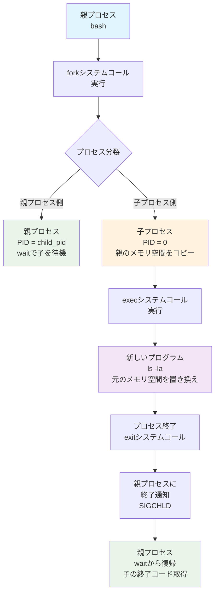
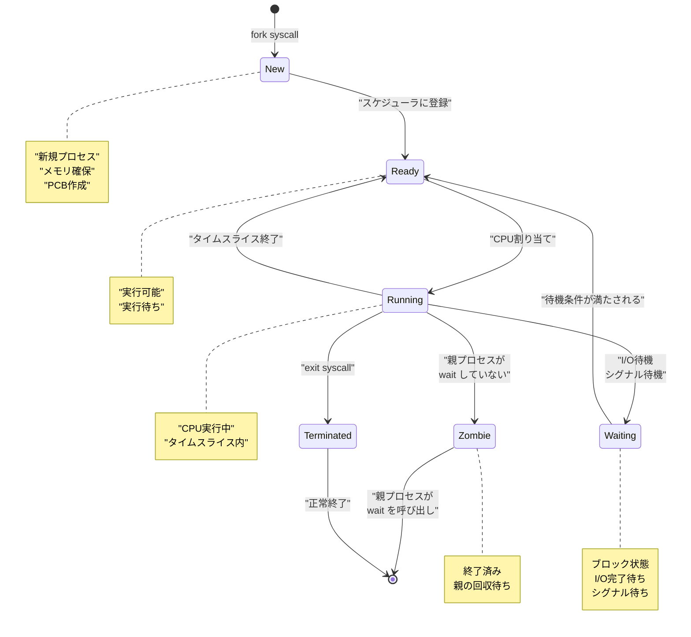

# 第5章：プロセスとシグナル - 並行処理の制御

## 5.1 はじめに：見えない世界で起きていること

今、あなたのLinuxシステムでは、数十から数百のプログラムが同時に動いています。Webブラウザでこの文章を読んでいる間も、システムは時刻を更新し、ネットワークを監視し、ログを記録し続けています。

しかし、CPUは一度に一つの命令しか実行できません。では、なぜ複数のプログラムが「同時に」動いているように見えるのでしょうか？

その秘密は、「プロセス」という概念と、それを管理する仕組みにあります。

## 5.2 マルチタスクOSが解決した課題

### コンピュータの歴史：バッチ処理からマルチタスクへ

#### 1960年代：バッチ処理の時代
```
プログラムA（3時間）→ 完了 → プログラムB（2時間）→ 完了 → プログラムC（1時間）
```

問題点：
- CPUが入出力待ちで遊んでいる時間が多い
- 一つのプログラムが終わるまで次が始められない
- 対話的な操作が不可能

#### 1970年代：タイムシェアリングの登場
```
時間軸 →
CPU: A→B→C→A→B→C→A→B→C...（高速切り替え）
人間の感覚: A、B、Cが同時に動いている！
```

UNIXが実現したこと：
- 複数のユーザーが同時にログイン
- 各ユーザーが独立してプログラムを実行
- システムリソースの公平な配分

### 現代のマルチタスクが可能にすること

```bash
# 同時に実行される処理の例
$ ps aux | head -20
USER       PID %CPU %MEM    VSZ   RSS TTY      STAT START   TIME COMMAND
root         1  0.0  0.2 168936 11424 ?        Ss   09:00   0:02 /sbin/init
root         2  0.0  0.0      0     0 ?        S    09:00   0:00 [kthreadd]
root       100  0.0  0.1 171636  6872 ?        Ss   09:00   0:00 /lib/systemd/systemd-journald
root       125  0.0  0.1  46696  6144 ?        Ss   09:00   0:00 /lib/systemd/systemd-udevd
systemd+   300  0.0  0.0  71968  5640 ?        Ss   09:00   0:00 /lib/systemd/systemd-resolved
root       400  0.0  0.1 239592  8192 ?        Ssl  09:00   0:00 /usr/lib/accounts-daemon
root       401  0.0  0.1  81952  7040 ?        Ss   09:00   0:00 /usr/sbin/cron -f
postgres  1234  0.1  0.8 293456 32768 ?        Ss   09:05   0:10 postgres: checkpointer
www-data  2345  0.5  0.4 187340 16384 ?        S    09:10   0:25 nginx: worker process
```

これらすべてが、限られたCPUコアを共有しながら動作しています。

## 5.3 プロセスの生成・実行・終了のライフサイクル

### プロセスとは何か

プロセスとは、「実行中のプログラム」のインスタンスです。同じプログラムでも、実行するたびに新しいプロセスが生成されます。

```bash
# 同じプログラム（bash）の複数のインスタンス
$ ps aux | grep bash
user1    1234  0.0  0.1  23456  4096 pts/0    Ss   09:00   0:00 -bash
user1    2345  0.0  0.1  23456  4096 pts/1    Ss   09:30   0:00 -bash
user1    3456  0.0  0.1  23456  4096 pts/2    Ss   10:00   0:00 -bash
```

### プロセスの誕生：fork()とexec()

Linuxでは、新しいプロセスは既存のプロセスから「分裂」して生まれます：



```c
// プロセス生成の基本的な流れ（C言語）
pid_t pid = fork();  // 自分のコピーを作る

if (pid == 0) {
    // 子プロセス
    execl("/bin/ls", "ls", "-la", NULL);  // 別のプログラムに変身
} else {
    // 親プロセス
    wait(NULL);  // 子プロセスの終了を待つ
}
```

実際の動作を観察：

```bash
# プロセスツリーを表示
$ pstree -p
init(1)─┬─systemd(100)─┬─systemd-journald(150)
        │              └─systemd-resolved(300)
        ├─sshd(500)───sshd(1234)───bash(1235)───pstree(5678)
        └─nginx(600)─┬─nginx(601)
                     └─nginx(602)
```

### プロセスの状態遷移

プロセスは以下の状態を遷移します：



状態の確認：

```bash
$ ps aux
# STATカラムの意味：
# R - Running（実行中）
# S - Sleeping（スリープ中）
# D - Uninterruptible sleep（割り込み不可能なスリープ）
# Z - Zombie（ゾンビ）
# T - Stopped（停止中）
```

### プロセスの終了

プロセスが終了する方法：

#### 1. 正常終了
```c
exit(0);  // 成功
exit(1);  // エラー
```

#### 2. シグナルによる終了
```bash
kill -TERM 1234  # 終了要求
kill -KILL 1234  # 強制終了
```

#### 3. 親プロセスの終了
親が死ぬと、子プロセスは`init`（PID 1）に引き取られます：

```bash
# 孤児プロセスの例
$ sleep 100 &
[1] 12345
$ exit  # 親シェルを終了
# sleepプロセスはinitの子になる
```

## 5.4 プロセスの管理とモニタリング

### 基本的なプロセス管理コマンド

#### ps - プロセスのスナップショット
```bash
# 全プロセスを詳細表示
ps aux

# ツリー形式で表示
ps auxf

# 特定のユーザーのプロセス
ps -u username

# メモリ使用量でソート
ps aux --sort=-%mem

# CPU使用量でソート
ps aux --sort=-%cpu
```

#### top - リアルタイムモニタリング
```bash
$ top
# 対話的コマンド：
# P - CPU使用率でソート
# M - メモリ使用率でソート
# k - プロセスをkill
# r - nice値を変更
# q - 終了
```

#### htop - より高機能なモニタリング
```bash
# htopのインストール（必要な場合）
sudo apt install htop  # Debian/Ubuntu
sudo yum install htop  # RHEL/CentOS

$ htop
# マウス対応、カラー表示、より直感的な操作
```

### プロセスの詳細情報

#### /proc/[PID]ディレクトリ
```bash
# プロセス1234の情報を調査
ls /proc/1234/
# cmdline - コマンドライン引数
# environ - 環境変数
# status  - 詳細な状態
# fd/     - オープンしているファイルディスクリプタ
# maps    - メモリマップ

# コマンドライン引数を見る
cat /proc/1234/cmdline | tr '\0' ' '

# 環境変数を見る
cat /proc/1234/environ | tr '\0' '\n'

# メモリ使用量を確認
cat /proc/1234/status | grep -E "VmSize|VmRSS|VmSwap"
```

### プロセスの優先度管理

#### nice値とスケジューリング
```bash
# nice値の範囲：-20（最高優先度）から 19（最低優先度）

# 低優先度で実行
nice -n 10 long_running_command

# 実行中のプロセスの優先度を変更
renice -n 5 -p 1234

# CPU使用率を制限（cpulimit）
cpulimit -p 1234 -l 50  # PID 1234を50%に制限
```

## 5.5 シグナル - プロセス間通信の仕組み

### シグナルとは

シグナルは、プロセスに「何か起きた」ことを通知する仕組みです。電話の着信音のようなものです。

主要なシグナル：

```bash
# よく使うシグナル一覧
kill -l
1) SIGHUP     - 設定再読み込み
2) SIGINT     - 割り込み（Ctrl+C）
3) SIGQUIT    - 終了（コアダンプ付き）
9) SIGKILL    - 強制終了（キャッチ不可）
15) SIGTERM   - 正常終了要求（デフォルト）
18) SIGCONT   - 再開
19) SIGSTOP   - 一時停止（キャッチ不可）
20) SIGTSTP   - 端末からの一時停止（Ctrl+Z）
```

### シグナルの送信と処理

#### シグナルの送信
```bash
# 基本的な使い方
kill -TERM 1234     # プロセス1234に終了要求
kill -9 1234        # 強制終了
kill -HUP 1234      # 設定再読み込み

# プロセス名でkill
pkill nginx         # nginxという名前のプロセスすべて
killall firefox     # firefoxという名前のプロセスすべて

# 条件付きkill
pgrep -f "python script.py" | xargs kill
```

#### シグナルハンドラの例（Bashスクリプト）
```bash
#!/bin/bash
# signal_handler.sh - シグナル処理の例

# クリーンアップ関数
cleanup() {
    echo "シグナルを受信しました。クリーンアップ中..."
    rm -f /tmp/tempfile.$$
    exit 0
}

# シグナルハンドラを設定
trap cleanup SIGINT SIGTERM

# メイン処理
echo "PID: $$"
echo "Ctrl+Cで終了します"

while true; do
    echo "動作中... $(date)"
    sleep 5
done
```

### 実践的なシグナルの使用例

#### 1. 設定の再読み込み（SIGHUP）
```bash
# nginxの設定を再読み込み
sudo kill -HUP $(cat /var/run/nginx.pid)
# または
sudo nginx -s reload

# systemdサービスの場合
sudo systemctl reload nginx
```

#### 2. デバッグ情報の出力（SIGUSR1/SIGUSR2）
```bash
# 独自シグナルハンドラの実装例
#!/bin/bash

dump_status() {
    echo "=== Status Dump at $(date) ==="
    echo "Memory usage: $(ps -o vsz,rss -p $$ | tail -1)"
    echo "Open files: $(lsof -p $$ | wc -l)"
}

trap dump_status SIGUSR1

# メイン処理
while true; do
    # 何か処理
    sleep 10
done
```

#### 3. グレースフルシャットダウン
```bash
#!/bin/bash
# graceful_shutdown.sh

running=true

shutdown() {
    echo "シャットダウンシグナルを受信。処理を完了しています..."
    running=false
}

trap shutdown SIGTERM SIGINT

while $running; do
    # 重要な処理
    echo "処理中..."
    sleep 1
    
    # ここで$runningをチェック
    if ! $running; then
        echo "現在の処理を完了してから終了します"
        # クリーンアップ処理
        break
    fi
done

echo "正常に終了しました"
```

## 5.6 障害時の原因特定と対処

### プロセスの異常状態

#### 1. ゾンビプロセス
```bash
# ゾンビプロセスの確認
ps aux | grep defunct
# または
ps aux | grep " Z "

# 親プロセスを特定
ps -o ppid,pid,stat,cmd -p $(ps aux | awk '$8 ~ /Z/ {print $2}')

# 解決方法：親プロセスをkillまたは修正
```

#### 2. 暴走プロセス（CPU 100%使用）
```bash
# CPU使用率の高いプロセスを特定
top -b -n 1 | head -20

# straceで何をしているか調査
sudo strace -p 1234 -c  # システムコールの統計

# 一時的な対処
cpulimit -p 1234 -l 50  # CPU使用率を50%に制限
```

#### 3. メモリリーク
```bash
# メモリ使用量の監視
watch -n 1 'ps aux | grep process_name'

# 詳細なメモリマップ
cat /proc/1234/maps
cat /proc/1234/smaps  # より詳細

# valgrindでメモリリークを検出（開発時）
valgrind --leak-check=full ./program
```

### トラブルシューティングのテクニック

#### 1. straceによるシステムコール追跡
```bash
# 新規プロセスの追跡
strace -f -o output.txt command

# 実行中のプロセスの追跡
sudo strace -p 1234

# ファイルアクセスのみ追跡
sudo strace -e trace=file -p 1234

# ネットワーク関連のみ追跡
sudo strace -e trace=network -p 1234
```

#### 2. lsofによるファイル使用状況
```bash
# プロセスが開いているファイル
lsof -p 1234

# 特定のファイルを使用しているプロセス
lsof /var/log/nginx/access.log

# ネットワーク接続
lsof -i :80  # ポート80を使用しているプロセス

# 削除されたが開かれているファイル
lsof | grep deleted
```

#### 3. デッドロックの検出
```bash
# プロセスの待機状態を確認
cat /proc/1234/wchan

# スレッドの状態
ps -eLf | grep process_name

# glibcのデッドロック検出
gdb -p 1234
(gdb) thread apply all bt  # 全スレッドのバックトレース
```

### リカバリー手順

#### 1. 応急処置
```bash
# 1. 問題のプロセスを特定
ps aux | grep -E "process|%CPU|%MEM" | head

# 2. 必要に応じてnice値を下げる
renice 19 -p 1234

# 3. それでもダメなら一時停止
kill -STOP 1234

# 4. 調査後、再開または終了
kill -CONT 1234  # 再開
# または
kill -TERM 1234  # 終了
```

#### 2. 根本対策
```bash
# リソース制限の設定
cat >> /etc/security/limits.conf << EOF
username soft nproc 1000
username hard nproc 2000
username soft nofile 4096
username hard nofile 8192
EOF

# systemdサービスの場合
cat >> /etc/systemd/system/service.service.d/limits.conf << EOF
[Service]
LimitNPROC=1000
LimitNOFILE=8192
MemoryLimit=1G
CPUQuota=50%
EOF
```

## 5.7 演習：プロセスの親子関係を追跡

### 演習1：プロセスツリーの理解

```bash
# 1. 現在のシェルのPIDを確認
echo $$

# 2. 子プロセスを作成
sleep 1000 &
child1=$!

# 3. 孫プロセスを作成
bash -c 'sleep 2000 &'

# 4. プロセスツリーを確認
pstree -p $$

# 5. 親子関係を確認
ps -o pid,ppid,cmd -p $$ -p $child1
```

### 演習2：フォークボムの理解と対策（注意：実行は慎重に）

```bash
# フォークボムの仕組みを理解（実行しないこと！）
# :(){ :|:& };:

# 安全な実験版
cat > safe_fork_test.sh << 'EOF'
#!/bin/bash
MAX_PROCS=10
count=0

fork_limited() {
    count=$((count + 1))
    echo "Process $count created (PID: $$)"
    
    if [ $count -lt $MAX_PROCS ]; then
        fork_limited &
    fi
    
    sleep 10
}

fork_limited
wait
EOF

# リソース制限下で実行
ulimit -u 20  # プロセス数制限
bash safe_fork_test.sh
```

### 演習3：シグナルの伝播実験

```bash
# signal_propagation.sh
cat > signal_propagation.sh << 'EOF'
#!/bin/bash

# 親プロセス
echo "親プロセス PID: $$"

# シグナルハンドラ
trap 'echo "親: SIGINTを受信"; exit' SIGINT

# 子プロセスを起動
bash -c '
    echo "子プロセス PID: $$"
    trap "echo \"子: SIGINTを受信\"" SIGINT
    sleep 100
' &

child_pid=$!
echo "子プロセス PID: $child_pid"

# 待機
wait
EOF

# 実行して、Ctrl+Cで割り込み
bash signal_propagation.sh
```

### 演習4：プロセスのリソース使用量追跡

```bash
# process_monitor.sh
cat > process_monitor.sh << 'EOF'
#!/bin/bash

if [ $# -ne 1 ]; then
    echo "Usage: $0 <PID>"
    exit 1
fi

PID=$1
INTERVAL=1
LOG_FILE="process_${PID}_monitor.log"

echo "Monitoring PID $PID. Press Ctrl+C to stop."
echo "Time,CPU%,MEM%,VSZ,RSS" > "$LOG_FILE"

while kill -0 $PID 2>/dev/null; do
    STATS=$(ps -p $PID -o %cpu,%mem,vsz,rss --no-headers)
    if [ -n "$STATS" ]; then
        echo "$(date +%Y-%m-%d\ %H:%M:%S),$STATS" | tee -a "$LOG_FILE"
    fi
    sleep $INTERVAL
done

echo "Process $PID has terminated."
EOF

# 使用例
firefox &
firefox_pid=$!
bash process_monitor.sh $firefox_pid
```

### 演習5：デッドロックの実験と解決

```bash
# deadlock_demo.sh
cat > deadlock_demo.sh << 'EOF'
#!/bin/bash

# 2つのロックファイル
LOCK1="/tmp/lock1.$$"
LOCK2="/tmp/lock2.$$"

# クリーンアップ
cleanup() {
    rm -f $LOCK1 $LOCK2
    exit
}
trap cleanup EXIT

# プロセス1：Lock1→Lock2の順
process1() {
    echo "Process 1: Acquiring lock1..."
    exec 200>$LOCK1
    flock 200
    echo "Process 1: Got lock1"
    sleep 2
    
    echo "Process 1: Acquiring lock2..."
    exec 201>$LOCK2
    flock 201
    echo "Process 1: Got lock2"
    
    sleep 1
    echo "Process 1: Releasing locks"
}

# プロセス2：Lock2→Lock1の順（デッドロックの可能性）
process2() {
    echo "Process 2: Acquiring lock2..."
    exec 201>$LOCK2
    flock 201
    echo "Process 2: Got lock2"
    sleep 2
    
    echo "Process 2: Acquiring lock1..."
    exec 200>$LOCK1
    flock 200
    echo "Process 2: Got lock1"
    
    sleep 1
    echo "Process 2: Releasing locks"
}

# 並行実行
process1 &
P1=$!

sleep 0.5

process2 &
P2=$!

# 監視
echo "Monitoring processes (PID: $P1, $P2)..."
while kill -0 $P1 2>/dev/null || kill -0 $P2 2>/dev/null; do
    sleep 1
    echo -n "."
done

echo
echo "Both processes completed"
EOF
```

## 5.8 まとめ：システムの鼓動を感じる

### プロセス管理の本質

本章で学んだプロセス管理は、Linuxシステムの心臓部です：

1. **生命のサイクル**：fork()による誕生、実行、そして終了
2. **協調と競合**：限られた資源を共有しながら動作
3. **コミュニケーション**：シグナルによる相互作用
4. **異常への対処**：問題の検出と解決

### 実務での応用

プロセス管理の知識は、以下の場面で必須となります：

- **パフォーマンスチューニング**：ボトルネックの特定と解消
- **障害対応**：異常プロセスの検出と対処
- **セキュリティ**：不正なプロセスの発見
- **自動化**：プロセスの監視と制御

### 次章への展望

プロセスが適切に動作するためには、適切な「権限」が必要です。次章では、Linuxのセキュリティの基礎となる権限管理システムについて学びます。

誰が何をできるのか。この単純な問いに対する答えが、システム全体のセキュリティを決定します。マルチユーザーシステムとしてのLinuxの真価を、次章で探求していきましょう。

## 章末演習問題

### 問題1：基本理解の確認
以下の文章の空欄を埋めてください。

1. Linuxで新しいプロセスは、（　　　）システムコールで既存プロセスをコピーし、（　　　）システムコールで別のプログラムに置き換えることで生成されます。
2. プロセスの状態には、実行中を表す（　）、スリープ中を表す（　）、ゾンビ状態を表す（　）などがあります。
3. プロセスに送信できる主要なシグナルには、割り込みの（　　　）、正常終了要求の（　　　）、強制終了の（　　　）があります。

### 問題2：概念の理解
次の質問に答えてください。

1. なぜLinuxではfork()とexec()を分けているのか、その設計の利点を説明してください。
2. ゾンビプロセスとは何か、なぜ発生するのか、どのように対処すべきか説明してください。
3. シグナルとプロセス間通信の他の方法（パイプ、ソケットなど）との違いを説明してください。

### 問題3：実践的な課題
以下のタスクを実現する方法を説明またはコマンドを記述してください。

1. 現在実行中のプロセスの中から、CPU使用率が50%を超えているものを特定し、そのプロセスの詳細情報（PID、コマンド、実行時間）を表示する。

2. 特定のプロセス（例：PID 1234）が使用しているメモリ量の変化を10秒ごとに記録し、グラフ化できる形式で出力する。

3. システム全体のプロセス数が500を超えた場合に警告を出すスクリプトを作成する。

### 問題4：トラブルシューティング
以下の状況に対して、どのように対処するか説明してください。

1. `ps aux`を実行すると、大量のゾンビプロセス（<defunct>）が表示される。
2. あるプロセスがCPUを100%使用し続けており、`kill -TERM`でも終了しない。
3. サーバーの応答が遅く、調査したところfork()が失敗している。

### 問題5：シグナルハンドリング
以下の要件を満たすシェルスクリプトを完成させてください。

```bash
#!/bin/bash
# graceful_server.sh - グレースフルシャットダウンを実装

# 要件：
# 1. 無限ループで1秒ごとに"Server is running..."を表示
# 2. SIGTERMを受信したら、現在の処理を完了してから終了
# 3. SIGHUPを受信したら、"Reloading configuration..."を表示
# 4. 終了時に"Server stopped gracefully"を表示

# ここにコードを記述
```

### 問題6：プロセス監視スクリプト
次の機能を持つプロセス監視スクリプトを作成してください。

```bash
#!/bin/bash
# process_watcher.sh - 指定したプロセスを監視

# 引数：監視対象のプロセス名
# 機能：
# 1. 指定されたプロセスが実行されているか30秒ごとにチェック
# 2. プロセスが見つからない場合は自動的に起動
# 3. プロセスが複数起動している場合は、最も古いもの以外を終了
# 4. ログファイルに全ての操作を記録

# ここにコードを記述
```

### 問題7：発展的課題
1. コンテナ技術（Docker、Podman）において、プロセスの隔離がどのように実現されているか、名前空間（namespace）とcgroupsの観点から説明してください。

2. systemdによるプロセス管理と、従来のSysV initによる管理の違いを、プロセスの起動順序と依存関係の観点から比較してください。