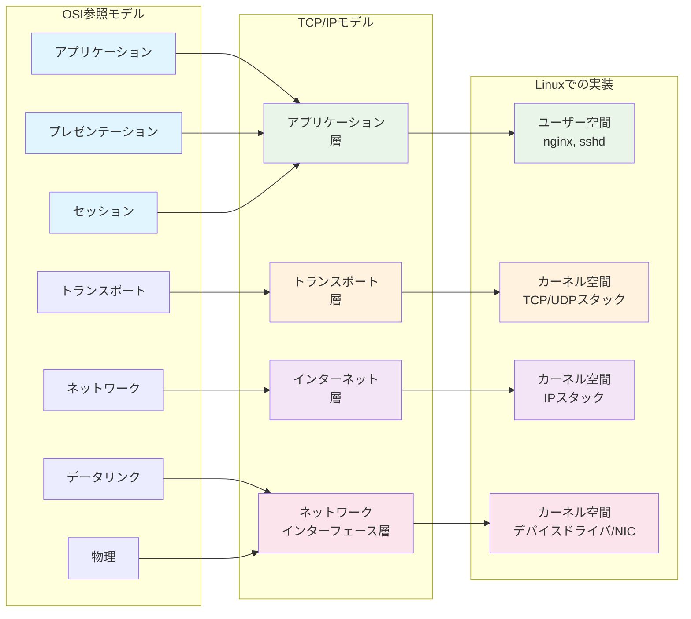

# 第7章：TCP/IPスタックとLinux

## 7.1 はじめに：インターネットという奇跡

あなたが日本からアメリカのWebサイトにアクセスするとき、データは太平洋を横断し、複数の国を経由し、数十のルーターを通過します。わずか数百ミリ秒で目的地に到達します。

この奇跡を可能にしているのが、TCP/IPという通信規約（プロトコル）です。Linuxはこのプロトコルスタックを見事に実装し、世界中のサーバーで動いています。

本章では、このネットワークの仕組みを、Linuxがどのように実現しているかという視点から解き明かします。

## 7.2 インターネットの成り立ちとOSI参照モデル

### インターネットの誕生

1969年、アメリカ国防総省のARPANETから始まったインターネット。その設計思想は革命的でした。

- **分散型**：中央管理者が存在しない
- **冗長性**：一部が破壊されても通信継続可能
- **拡張性**：新しいネットワークを簡単に追加可能

この思想は、今日のインターネットの基礎となっています。

### OSI参照モデル：通信の7層構造

複雑なネットワーク通信を理解するため、OSI（Open Systems Interconnection）参照モデルが作られました。


### TCP/IPモデル：実用的な4層構造

実際のインターネットでは、よりシンプルなTCP/IPモデルが使われています。



## 7.3 各層の役割と相互作用

### レイヤー1：物理層とデータリンク層

#### ネットワークインターフェースの確認
```bash
# ネットワークインターフェースの一覧
$ ip link show
1: lo: <LOOPBACK,UP,LOWER_UP> mtu 65536 qdisc noqueue state UNKNOWN
    link/loopback 00:00:00:00:00:00 brd 00:00:00:00:00:00
2: eth0: <BROADCAST,MULTICAST,UP,LOWER_UP> mtu 1500 qdisc fq_codel state UP
    link/ether 52:54:00:12:34:56 brd ff:ff:ff:ff:ff:ff

# 物理的な接続状態
$ ethtool eth0
Settings for eth0:
    Link detected: yes
    Speed: 1000Mb/s
    Duplex: Full
```

#### MACアドレスとARP
```bash
# ARPテーブルの確認（隣接機器のMACアドレス）
$ arp -n
Address         HWtype  HWaddress           Flags Mask  Iface
192.168.1.1     ether   00:11:22:33:44:55   C           eth0
192.168.1.100   ether   aa:bb:cc:dd:ee:ff   C           eth0

# ARPリクエストの送信
$ arping -c 3 192.168.1.1
ARPING 192.168.1.1 from 192.168.1.10 eth0
Unicast reply from 192.168.1.1 [00:11:22:33:44:55]  0.635ms
```

### レイヤー2：インターネット層（IP）

#### IPアドレスの管理
```bash
# IPアドレスの確認
$ ip addr show
2: eth0: <BROADCAST,MULTICAST,UP,LOWER_UP> mtu 1500 qdisc fq_codel state UP
    inet 192.168.1.10/24 brd 192.168.1.255 scope global eth0
    inet6 fe80::5054:ff:fe12:3456/64 scope link

# IPアドレスの追加
$ sudo ip addr add 192.168.1.20/24 dev eth0

# ルーティングテーブル
$ ip route show
default via 192.168.1.1 dev eth0 proto dhcp metric 100
192.168.1.0/24 dev eth0 proto kernel scope link src 192.168.1.10
```

#### パケットの旅路を追跡
```bash
# tracerouteでパケットの経路を確認
$ traceroute google.com
traceroute to google.com (172.217.175.110), 30 hops max
 1  gateway (192.168.1.1)  0.543 ms
 2  10.0.0.1 (10.0.0.1)  2.145 ms
 3  203.0.113.1 (203.0.113.1)  10.234 ms
 ...
 8  nrt12s02-in-f14.1e100.net (172.217.175.110)  25.432 ms
```

## 7.4 Linux ネットワークスタックの詳細アーキテクチャ

### カーネル空間でのパケット処理フロー


### パケット処理の詳細フロー

```bash
# パケット受信処理の確認
cat /proc/net/softnet_stat

# ネットワークスタックの統計情報
ss -s

# インターフェース統計詳細
cat /proc/net/dev

# プロトコル別統計
cat /proc/net/netstat
cat /proc/net/snmp
```

## ネットワーク診断の実践コマンド

### 基本的な接続確認

```bash
# ネットワーク接続の基本確認
ping -c 4 8.8.8.8                    # Google DNSへの疎通確認
ping -c 4 google.com                 # 名前解決と疎通の確認

# 詳細な接続確認
mtr google.com                        # 継続的なtraceroute
ss -tuln                             # 開いているポート確認
netstat -rn                          # ルーティングテーブル表示

# ネットワーク統計情報
ss -s                                # 接続統計サマリー
cat /proc/net/dev                    # インターフェース統計
iftop                                # リアルタイム帯域使用量
```

### トラブルシューティング実例

```bash
# Webサーバーに接続できない場合の調査手順

# 1. 基本的な疎通確認
ping webserver.example.com

# 2. 名前解決の確認  
nslookup webserver.example.com
dig webserver.example.com

# 3. ポート開放確認
telnet webserver.example.com 80
nc -zv webserver.example.com 80

# 4. ファイアウォール確認
sudo iptables -L -n
sudo firewall-cmd --list-all

# 5. プロセス確認
sudo ss -tlnp | grep :80
ps aux | grep nginx
```

### ネットワーク構成図


### レイヤー3：トランスポート層（TCP/UDP）

#### TCPの仕組み
```bash
# TCP接続の確認
$ ss -tan
State  Recv-Q Send-Q Local Address:Port   Peer Address:Port
LISTEN 0      128    0.0.0.0:22          0.0.0.0:*
ESTAB  0      0      192.168.1.10:22     192.168.1.100:54321
ESTAB  0      0      192.168.1.10:45678  93.184.216.34:80

# TCPの状態遷移
# LISTEN → SYN_RECV → ESTABLISHED → FIN_WAIT → TIME_WAIT → CLOSED
```

#### TCPの3ウェイハンドシェイク


### レイヤー4：アプリケーション層

#### ポートとサービス
```bash
# よく使われるポート
$ cat /etc/services | grep -E "^(ssh|http|https|ftp|smtp)"
ftp             21/tcp
ssh             22/tcp
smtp            25/tcp
http            80/tcp
https           443/tcp

# リッスンしているポート
$ sudo ss -tlnp
State  Recv-Q Send-Q Local Address:Port  Process
LISTEN 0      128    0.0.0.0:22          sshd
LISTEN 0      128    0.0.0.0:80          nginx
LISTEN 0      128    0.0.0.0:443         nginx
```

## 7.5 トラブルシューティングの体系的アプローチ

### レイヤーごとの診断

#### 物理層の確認
```bash
# ケーブルが接続されているか
$ ip link show eth0 | grep "state UP"

# リンク速度とデュプレックス
$ ethtool eth0 | grep -E "Speed|Duplex"
```

#### データリンク層の確認
```bash
# 同一ネットワーク内の通信確認
$ ping -c 3 192.168.1.1  # デフォルトゲートウェイ

# ARPの問題を調査
$ sudo tcpdump -i eth0 arp
```

#### ネットワーク層の確認
```bash
# 外部への到達性
$ ping -c 3 8.8.8.8  # Google DNS

# ルーティングの確認
$ ip route get 8.8.8.8
8.8.8.8 via 192.168.1.1 dev eth0 src 192.168.1.10

# MTUの問題を調査
$ ping -c 3 -M do -s 1472 google.com
```

#### トランスポート層の確認
```bash
# ポートの到達性
$ nc -zv google.com 80
Connection to google.com 80 port [tcp/http] succeeded!

# TCPの詳細な状態
$ ss -i
tcp   ESTAB  0  0  192.168.1.10:22  192.168.1.100:54321
      cubic wscale:7,7 rto:204 rtt:1.875/0.75 ato:40 mss:1448
```

### 実践的なトラブルシューティング

#### ケース1：Webサイトにアクセスできない

```bash
#!/bin/bash
# web_troubleshoot.sh - Web接続問題の診断

TARGET="example.com"

echo "=== Web Connectivity Troubleshooting ==="

# 1. DNS解決
echo "1. DNS Resolution:"
if host $TARGET > /dev/null 2>&1; then
    echo "   ✓ DNS解決成功"
    IP=$(host $TARGET | awk '/has address/ {print $4; exit}')
    echo "   IP: $IP"
else
    echo "   ✗ DNS解決失敗"
    echo "   DNSサーバーを確認してください: cat /etc/resolv.conf"
    exit 1
fi

# 2. ICMP到達性
echo "2. ICMP Reachability:"
if ping -c 3 -W 2 $IP > /dev/null 2>&1; then
    echo "   ✓ ICMP応答あり"
else
    echo "   ⚠ ICMP応答なし（ファイアウォールの可能性）"
fi

# 3. ポート80の確認
echo "3. Port 80 (HTTP):"
if nc -zv -w 2 $TARGET 80 2>&1 | grep -q succeeded; then
    echo "   ✓ ポート80接続成功"
else
    echo "   ✗ ポート80接続失敗"
fi

# 4. ポート443の確認
echo "4. Port 443 (HTTPS):"
if nc -zv -w 2 $TARGET 443 2>&1 | grep -q succeeded; then
    echo "   ✓ ポート443接続成功"
else
    echo "   ✗ ポート443接続失敗"
fi

# 5. HTTPレスポンスの確認
echo "5. HTTP Response:"
response=$(curl -s -o /dev/null -w "%{http_code}" -m 5 http://$TARGET)
echo "   HTTPステータスコード: $response"

# 6. 経路の確認
echo "6. Network Path:"
echo "   最初の5ホップ:"
traceroute -m 5 $TARGET 2>/dev/null | tail -n +2
```

#### ケース2：ネットワークが遅い

```bash
# 帯域幅の測定
$ iperf3 -c speedtest.server.com
Connecting to host speedtest.server.com, port 5201
[ ID] Interval       Transfer     Bandwidth
[  4] 0.00-10.00 sec  112 MBytes  94.1 Mbits/sec

# パケットロスの確認
$ mtr --report --report-cycles 100 google.com
HOST: localhost    Loss%   Snt   Last   Avg  Best  Wrst StDev
  1. gateway       0.0%    100    0.5   0.6   0.4   1.2   0.1
  2. 10.0.0.1      0.0%    100    2.1   2.3   1.9   3.5   0.3
  ...
  8. google.com    0.0%    100   25.4  25.6  25.1  26.8   0.4

# TCP輻輳制御の確認
$ ss -i | grep -A1 "cubic"
```

## 7.6 演習：パケットキャプチャで通信を可視化

### 演習1：HTTPリクエストの解析

```bash
# tcpdumpでHTTP通信をキャプチャ
$ sudo tcpdump -i any -A -s 0 'tcp port 80' -w http_capture.pcap

# 別ターミナルでHTTPリクエスト送信
$ curl http://example.com

# キャプチャの停止（Ctrl+C）

# Wiresharkで詳細解析（GUIがある場合）
$ wireshark http_capture.pcap

# CUIでの解析
$ tcpdump -r http_capture.pcap -A | less
```

### 演習2：TCP 3ウェイハンドシェイクの観察

```bash
# SYNパケットのみをキャプチャ
$ sudo tcpdump -i any 'tcp[tcpflags] & (tcp-syn) != 0' -nn

# 別ターミナルで接続
$ nc google.com 80

# 出力例：
# 12:34:56.789 IP 192.168.1.10.54321 > 172.217.175.110.80: Flags [S], seq 1234567890
# 12:34:56.810 IP 172.217.175.110.80 > 192.168.1.10.54321: Flags [S.], seq 987654321, ack 1234567891
# 12:34:56.811 IP 192.168.1.10.54321 > 172.217.175.110.80: Flags [.], ack 987654322
```

### 演習3：DNSクエリの追跡

```bash
# DNSトラフィックのキャプチャ
$ sudo tcpdump -i any port 53 -nn -v

# DNS解決を実行
$ dig google.com

# 解析スクリプト
cat > dns_analyzer.sh << 'EOF'
#!/bin/bash
echo "=== DNS Query Analysis ==="
sudo tcpdump -i any -c 10 port 53 -nn 2>/dev/null | while read line; do
    if echo "$line" | grep -q "A?"; then
        query=$(echo "$line" | grep -oE "[a-zA-Z0-9.-]+\. \(")
        echo "Query: ${query% (}"
    elif echo "$line" | grep -q "A "; then
        answer=$(echo "$line" | grep -oE "A [0-9.]+")
        echo "Answer: $answer"
    fi
done
EOF
```

### 演習4：ネットワーク遅延の分析

```bash
# ping統計の詳細分析
cat > latency_analyzer.sh << 'EOF'
#!/bin/bash
TARGET=${1:-google.com}
COUNT=100

echo "Analyzing latency to $TARGET..."

# pingの実行と統計収集
ping -c $COUNT $TARGET | tee ping_results.txt | \
awk '/time=/ {
    gsub(/.*time=/, "", $0)
    gsub(/ ms.*/, "", $0)
    print $0
}' > latencies.txt

# 統計計算
echo
echo "=== Latency Statistics ==="
awk '{
    sum += $1
    sumsq += $1 * $1
    if (NR == 1 || $1 < min) min = $1
    if (NR == 1 || $1 > max) max = $1
} END {
    avg = sum / NR
    variance = (sumsq / NR) - (avg * avg)
    stddev = sqrt(variance)
    printf "Samples: %d\n", NR
    printf "Min: %.2f ms\n", min
    printf "Max: %.2f ms\n", max
    printf "Average: %.2f ms\n", avg
    printf "StdDev: %.2f ms\n", stddev
    printf "Jitter: %.2f ms\n", max - min
}' latencies.txt

# ヒストグラムの作成
echo
echo "=== Latency Distribution ==="
awk '{
    bucket = int($1 / 10) * 10
    count[bucket]++
} END {
    for (b in count) {
        printf "%3d-%3d ms: ", b, b+9
        for (i = 0; i < count[b]; i++) printf "*"
        printf " (%d)\n", count[b]
    }
}' latencies.txt | sort -n
EOF

chmod +x latency_analyzer.sh
./latency_analyzer.sh google.com
```

### 演習5：総合ネットワーク診断ツール

```bash
# network_diagnostic.sh - 総合診断ツール
cat > network_diagnostic.sh << 'EOF'
#!/bin/bash

# 色付け関数
RED='\033[0;31m'
GREEN='\033[0;32m'
YELLOW='\033[1;33m'
NC='\033[0m'

ok() { echo -e "${GREEN}✓${NC} $1"; }
fail() { echo -e "${RED}✗${NC} $1"; }
warn() { echo -e "${YELLOW}⚠${NC} $1"; }

echo "=== Network Diagnostic Tool ==="
echo "Timestamp: $(date)"
echo

# 1. インターフェース確認
echo "1. Network Interfaces:"
for iface in $(ip -o link show | awk -F': ' '{print $2}'); do
    state=$(ip link show $iface | grep -oP '(?<=state )\w+')
    if [ "$state" = "UP" ]; then
        ok "$iface is UP"
        ip -4 addr show $iface | grep inet | awk '{print "   " $2}'
    else
        [ "$iface" != "lo" ] && warn "$iface is $state"
    fi
done

# 2. デフォルトゲートウェイ
echo
echo "2. Default Gateway:"
gw=$(ip route | grep default | awk '{print $3}')
if [ -n "$gw" ]; then
    ok "Gateway: $gw"
    if ping -c 1 -W 2 $gw > /dev/null 2>&1; then
        ok "Gateway reachable"
    else
        fail "Gateway unreachable"
    fi
else
    fail "No default gateway"
fi

# 3. DNS解決
echo
echo "3. DNS Resolution:"
for dns in $(grep nameserver /etc/resolv.conf | awk '{print $2}'); do
    if nc -zvu -w 1 $dns 53 2>&1 | grep -q succeeded; then
        ok "DNS server $dns reachable"
    else
        fail "DNS server $dns unreachable"
    fi
done

if host google.com > /dev/null 2>&1; then
    ok "DNS resolution working"
else
    fail "DNS resolution failed"
fi

# 4. 外部接続
echo
echo "4. Internet Connectivity:"
if ping -c 3 -W 2 8.8.8.8 > /dev/null 2>&1; then
    ok "Internet reachable (ICMP)"
else
    warn "No ICMP response from 8.8.8.8"
fi

if curl -s --connect-timeout 5 http://www.google.com > /dev/null 2>&1; then
    ok "HTTP connectivity working"
else
    fail "HTTP connectivity failed"
fi

# 5. ポートスキャン（ローカル）
echo
echo "5. Local Services:"
for port in 22 80 443 3306 5432; do
    service=$(grep -E "^[a-z]+\s+$port/tcp" /etc/services | awk '{print $1}')
    if ss -tln | grep -q ":$port "; then
        ok "Port $port ($service) is listening"
    fi
done

# 6. ネットワーク統計
echo
echo "6. Network Statistics:"
echo "   Active connections: $(ss -s | grep 'TCP:' | awk '{print $2}')"
echo "   Network errors:"
for iface in $(ls /sys/class/net/); do
    [ "$iface" = "lo" ] && continue
    errors=$(cat /sys/class/net/$iface/statistics/rx_errors)
    drops=$(cat /sys/class/net/$iface/statistics/rx_dropped)
    if [ $errors -gt 0 ] || [ $drops -gt 0 ]; then
        warn "$iface: errors=$errors, drops=$drops"
    fi
done

echo
echo "=== Diagnostic Complete ==="
EOF

chmod +x network_diagnostic.sh
./network_diagnostic.sh
```

## 7.7 Linuxネットワークスタックの内部

### カーネルのネットワーク処理

```bash
# ネットワーク関連のカーネルパラメータ
$ sysctl -a | grep net.ipv4 | head -10
net.ipv4.tcp_congestion_control = cubic
net.ipv4.tcp_keepalive_time = 7200
net.ipv4.tcp_max_syn_backlog = 4096
net.ipv4.ip_forward = 0

# パフォーマンスチューニング
# /etc/sysctl.d/99-network-tuning.conf
cat > network_tuning.conf << EOF
# TCPバッファサイズの増加
net.core.rmem_max = 134217728
net.core.wmem_max = 134217728
net.ipv4.tcp_rmem = 4096 87380 134217728
net.ipv4.tcp_wmem = 4096 65536 134217728

# 接続数の増加
net.core.somaxconn = 65535
net.ipv4.tcp_max_syn_backlog = 65535

# TIME_WAIT接続の再利用
net.ipv4.tcp_tw_reuse = 1
EOF
```

### ネットワーク名前空間

```bash
# ネットワーク名前空間の作成
$ sudo ip netns add test_ns

# 名前空間内でコマンド実行
$ sudo ip netns exec test_ns ip link show
1: lo: <LOOPBACK> mtu 65536 qdisc noop state DOWN

# 仮想イーサネットペアの作成
$ sudo ip link add veth0 type veth peer name veth1
$ sudo ip link set veth1 netns test_ns

# IPアドレスの設定
$ sudo ip addr add 10.0.0.1/24 dev veth0
$ sudo ip netns exec test_ns ip addr add 10.0.0.2/24 dev veth1

# 通信テスト
$ ping 10.0.0.2
```

## 7.8 まとめ：ネットワークは層の積み重ね

### 理解すべき重要概念

本章で学んだTCP/IPスタックの理解は、現代のITインフラエンジニアにとって必須です。

1. **階層化の利点**：各層が独立して機能し、問題の切り分けが容易
2. **プロトコルの役割**：各層で異なるプロトコルが協調動作
3. **トラブルシューティング**：下位層から順に確認する体系的アプローチ
4. **Linuxの実装**：強力なツール群による可視化と制御

### 実務での応用

- **障害対応**：問題の層を特定し、効率的に解決
- **パフォーマンス改善**：ボトルネックの特定と最適化
- **セキュリティ**：各層での防御策の実装
- **設計**：適切なプロトコルとアーキテクチャの選択

### 次章への展望

ネットワークで通信する機器を、人間が覚えやすい「名前」で識別する仕組み。それが次章で学ぶ「名前解決」です。

DNSという巨大な分散データベースがどのように動作し、Linuxシステムがそれをどう活用しているか。インターネットの基盤技術の一つを、詳しく見ていきましょう。

## 章末演習問題

### 問題1：基本理解の確認
以下の文章の空欄を埋めてください。

1. OSI参照モデルは（　）層から構成され、TCP/IPモデルは（　）層から構成されます。
2. IPアドレスは（　　　）層で使用され、MACアドレスは（　　　　　）層で使用されます。
3. TCPの3ウェイハンドシェイクは、（　　）→（　　　　　）→（　　）の順序で行われます。

### 問題2：概念の理解
次の質問に答えてください。

1. なぜインターネットでは階層的なプロトコルスタックを採用しているのか、その利点を3つ挙げて説明してください。
2. TCPとUDPの違いを、信頼性、速度、用途の観点から比較してください。
3. NATが必要になった背景と、それがもたらす問題点を説明してください。

### 問題3：実践的な課題
以下のネットワークトラブルシューティングを行ってください。

1. あるサーバーにSSH接続できない。原因を特定するために確認すべき項目を、OSI参照モデルの下位層から順に列挙してください。

2. Webサイトの表示が遅い。ネットワークが原因かどうかを切り分ける方法を説明してください。

3. 以下のtcpdumpの出力から、何が起きているか説明してください。
```text
10:15:23.123456 IP 192.168.1.100.54321 > 93.184.216.34.80: Flags [S], seq 1234567890
10:15:23.234567 IP 93.184.216.34.80 > 192.168.1.100.54321: Flags [S.], seq 987654321, ack 1234567891
10:15:23.234789 IP 192.168.1.100.54321 > 93.184.216.34.80: Flags [.], ack 987654322
10:15:26.345678 IP 192.168.1.100.54321 > 93.184.216.34.80: Flags [F.], seq 1234567891, ack 987654322
```

### 問題4：ネットワーク設定
以下の要件を満たすようにLinuxサーバーのネットワークを設定するコマンドを記述してください。

1. eth0インターフェースに固定IPアドレス192.168.1.100/24を設定
2. デフォルトゲートウェイを192.168.1.1に設定
3. DNSサーバーを8.8.8.8と8.8.4.4に設定
4. 設定を永続化する

### 問題5：パケットフィルタリング
iptablesを使用して以下のファイアウォールルールを実装してください。

1. SSH（22番ポート）は特定のIPアドレス（10.0.0.0/24）からのみ許可
2. HTTP（80番）とHTTPS（443番）は全てのIPから許可
3. それ以外の受信接続はすべて拒否
4. 送信接続はすべて許可

### 問題6：トラブルシューティングスクリプト
以下の機能を持つネットワーク診断スクリプトを作成してください。

```bash
#!/bin/bash
# network_diagnostics.sh - ネットワーク診断スクリプト

# 引数：対象ホスト名またはIPアドレス
# 機能：
# 1. 対象ホストへのping疎通確認
# 2. 対象ホストまでの経路をtracerouteで表示
# 3. DNS解決が正常に行われているか確認
# 4. 対象ホストの特定ポート（80, 443, 22）への接続性確認
# 5. 結果をレポート形式で出力

# ここにコードを記述
```

### 問題7：パフォーマンス分析
以下のコマンドの出力から、ネットワークパフォーマンスの問題を分析してください。

```bash
$ netstat -s | grep -i retrans
    1523 segments retransmitted
    TCPLostRetransmit: 234
    456 fast retransmits

$ ss -i | grep -A1 "rtt"
    rtt:250.5/125.3 ms
```

何が問題の可能性があり、どのような対策が考えられますか？

### 問題8：発展的課題
1. IPv4からIPv6への移行が進まない技術的・経済的理由を分析し、どのような解決策が考えられるか提案してください。

2. SDN（Software Defined Networking）が従来のネットワークアーキテクチャと比べてどのような利点があるか、Linuxでの実装例を含めて説明してください。
