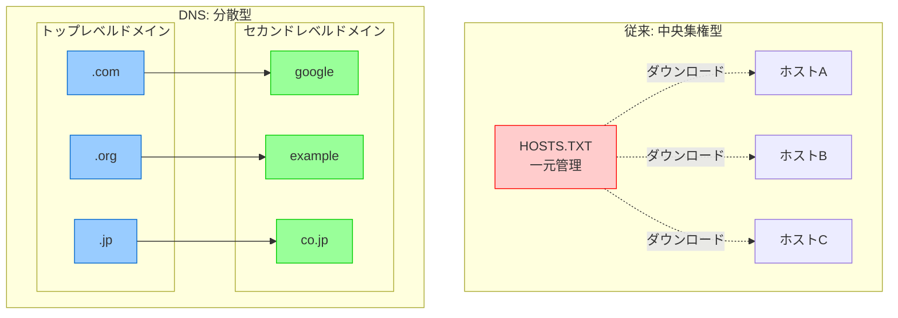
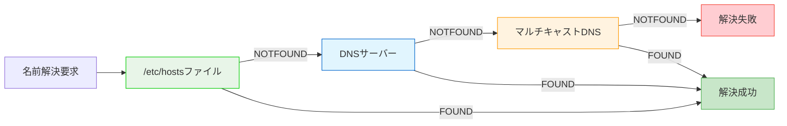
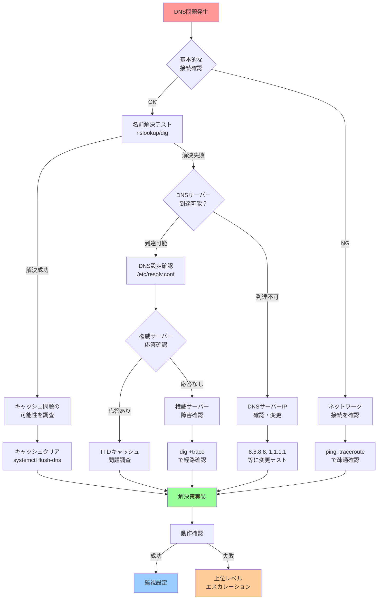

# 第8章：名前解決とサービス発見

## 8.1 はじめに：数字から名前への進化

「93.184.216.34」

この数字の羅列を見て、すぐに何を指しているか分かる人はいないでしょう。しかし、「example.com」と言えば、多くの人が理解します。

人間は名前で物事を認識し、コンピュータは数字で処理する。この根本的なギャップを埋めるのが「名前解決」という仕組みです。

本章では、インターネットの電話帳とも言えるDNSを中心に、Linuxシステムにおける名前解決の仕組みを理解します。

## 8.2 IPアドレスから名前への進化

### インターネット初期の課題

1970年代、インターネットの前身であるARPANETでは、すべてのホストの情報を一つのファイルで管理していました。

```bash
# 当時のHOSTS.TXTファイルの例
# IPアドレス  ホスト名        別名
10.0.0.1      HOST1          server1
10.0.0.2      HOST2          server2
10.0.0.3      MAILSERVER     mail
```

問題点：
- 中央管理のため、更新が遅い
- ネットワークが大きくなると管理不可能
- 名前の重複を防げない

### 分散型データベースの誕生

1983年、Paul MockapetrisによってDNS（Domain Name System）が発明されました。



## 8.3 DNS、mDNS、サービスディスカバリの仕組み

### DNS（Domain Name System）の階層構造

```text
                    .(root)
                   /   |   \
                .com  .org  .jp
               /  |    |     \
         google  example    co.jp
         /   \              /    \
      www   mail        yahoo  example
```

#### DNSクエリの流れ

```text
# www.example.comを解決する流れ（簡略化した例）
1. クライアント → ローカルDNSサーバー：「www.example.comのIPは？」
2. ローカルDNS → ルートサーバー：「.comを管理しているのは？」
3. ルートサーバー → ローカルDNS：「.comサーバーはここです」
4. ローカルDNS → .comサーバー：「example.comを管理しているのは？」
5. .comサーバー → ローカルDNS：「example.comサーバーはここです」
6. ローカルDNS → example.comサーバー：「www.example.comのIPは？」
7. example.comサーバー → ローカルDNS：「93.184.216.34です」
8. ローカルDNS → クライアント：「93.184.216.34です」
```

**注意**: 実際のDNS解決では、キャッシュ、TTL、CDNのエニーキャスト、DNSSEC検証、負荷分散などの要素が関与し、より複雑な処理が行われます。

### LinuxでのDNS設定と動作

#### /etc/resolv.conf - DNSクライアント設定
```bash
# 基本的な設定
$ cat /etc/resolv.conf
nameserver 8.8.8.8          # プライマリDNSサーバー
nameserver 8.8.4.4          # セカンダリDNSサーバー
search example.com local    # 検索ドメイン
options timeout:2 attempts:3 # タイムアウトと再試行

# systemd-resolvedを使用している場合
$ ls -la /etc/resolv.conf
lrwxrwxrwx 1 root root 39 Mar 15 10:00 /etc/resolv.conf -> ../run/systemd/resolve/stub-resolv.conf
```

#### /etc/hosts - ローカル名前解決
```bash
$ cat /etc/hosts
127.0.0.1       localhost
127.0.1.1       mycomputer.local mycomputer

# 開発環境での活用
192.168.1.100   dev.myapp.local
192.168.1.101   db.myapp.local
192.168.1.102   cache.myapp.local
```

#### /etc/nsswitch.conf - 名前解決の順序
```bash
$ grep hosts /etc/nsswitch.conf
hosts: files dns mDNS4_minimal [NOTFOUND=return]
```

名前解決の順序:



### DNSレコードの種類

```bash
# 主要なレコードタイプ
A       - IPv4アドレス
AAAA    - IPv6アドレス
CNAME   - 別名（エイリアス）
MX      - メールサーバー
TXT     - テキスト情報
NS      - ネームサーバー
SOA     - 権威の開始
PTR     - 逆引き（IPから名前）
SRV     - サービスロケーション
```

#### 実際のDNSクエリ
```bash
# Aレコード（IPv4アドレス）
$ dig example.com A
;; ANSWER SECTION:
example.com.    3600    IN      A       93.184.216.34

# MXレコード（メールサーバー）
$ dig example.com MX
;; ANSWER SECTION:
example.com.    3600    IN      MX      10 mail.example.com.

# 詳細な情報を含むクエリ
$ dig +trace example.com
```

### mDNS（Multicast DNS）- ローカルネットワークでの名前解決

```bash
# mDNSの動作原理
# 1. マルチキャストアドレス（224.0.0.251）に問い合わせ
# 2. 該当するホストが直接応答
# 3. DNSサーバー不要

# Avahiデーモンの確認
$ systemctl status avahi-daemon
● avahi-daemon.service - Avahi mDNS/DNS-SD Stack
     Active: active (running)

# mDNSでの名前解決
$ avahi-resolve -n mycomputer.local
mycomputer.local    192.168.1.100

# ローカルネットワークのサービス検索
$ avahi-browse -a
+   eth0 IPv4 Brother Printer           _printer._tcp        local
+   eth0 IPv4 Living Room TV            _googlecast._tcp     local
```

### サービスディスカバリ

#### DNS-SD（DNS Service Discovery）
```bash
# サービスの公開
$ avahi-publish-service "My Web Server" _http._tcp 80 "path=/" "version=1.0"

# サービスの検索
$ avahi-browse -r _http._tcp
=   eth0 IPv4 My Web Server             _http._tcp           local
   hostname = [myserver.local]
   address = [192.168.1.100]
   port = [80]
   txt = ["path=/" "version=1.0"]
```

#### SRVレコードによるサービス発見
```bash
# SRVレコードの形式
_service._proto.name. TTL class SRV priority weight port target.

# 例：KerberosサーバーのSRVレコード
$ dig _kerberos._tcp.example.com SRV
;; ANSWER SECTION:
_kerberos._tcp.example.com. 3600 IN SRV 0 100 88 kdc1.example.com.
_kerberos._tcp.example.com. 3600 IN SRV 0 100 88 kdc2.example.com.
```

## 8.4 スケーラブルなシステム設計

### 負荷分散とDNS

#### DNSラウンドロビン
```bash
# 複数のAレコードによる簡易負荷分散
$ dig www.example.com A
;; ANSWER SECTION:
www.example.com.    300    IN    A    192.0.2.1
www.example.com.    300    IN    A    192.0.2.2
www.example.com.    300    IN    A    192.0.2.3

# 毎回異なる順序で返される
```

#### GeoDNS - 地理的負荷分散
```bash
# クライアントの地域に応じて異なるIPを返す
# 東京からのクエリ
$ dig www.global-service.com
;; ANSWER SECTION:
www.global-service.com.    300    IN    A    203.0.113.1  # 東京DC

# ニューヨークからのクエリ
$ dig www.global-service.com
;; ANSWER SECTION:
www.global-service.com.    300    IN    A    198.51.100.1  # NY DC
```

### 内部DNSの設計

#### スプリットDNS（Split-horizon DNS）
```bash
# 外部向けDNS設定（BIND）
zone "example.com" {
    type master;
    file "/etc/bind/external/example.com.zone";
    allow-query { any; };
};

# 内部向けDNS設定
zone "example.com" {
    type master;
    file "/etc/bind/internal/example.com.zone";
    allow-query { 192.168.0.0/16; 10.0.0.0/8; };
};

# 外部向けゾーンファイル
www    IN    A    203.0.113.1    # 公開IP

# 内部向けゾーンファイル  
www    IN    A    192.168.1.100  # プライベートIP
```

### キャッシュとパフォーマンス

#### ローカルDNSキャッシュ
```bash
# systemd-resolvedの統計情報
$ resolvectl statistics
Current Transactions: 0
Total Transactions: 15842
  Current Cache Size: 231
          Cache Hits: 12453
        Cache Misses: 3389

# キャッシュのフラッシュ
$ sudo resolvectl flush-caches

# dnsmasqを使用したキャッシュ
$ cat /etc/dnsmasq.conf
cache-size=1000
no-negcache
```

#### TTL（Time To Live）の理解
```bash
# TTLの確認
$ dig example.com
;; ANSWER SECTION:
example.com.    86400    IN    A    93.184.216.34
#               ↑ TTL（秒）

# 短いTTL：変更が早く反映されるが、クエリが増える
# 長いTTL：クエリは減るが、変更反映が遅い
```

## 8.5 演習：名前解決の失敗パターンと対処

### 演習1：DNS解決の追跡

```bash
# dns_trace.sh - DNS解決の詳細追跡
cat > dns_trace.sh << 'EOF'
#!/bin/bash

DOMAIN=${1:-example.com}

echo "=== DNS Resolution Trace for $DOMAIN ==="
echo

# 1. ローカル設定の確認
echo "1. Local Configuration:"
echo "   /etc/resolv.conf:"
grep -E "^(nameserver|search|domain)" /etc/resolv.conf | sed 's/^/   /'

echo
echo "   /etc/hosts:"
grep -E "$DOMAIN|^[^#]" /etc/hosts | grep -v "^127.0.0.1" | head -5 | sed 's/^/   /'

# 2. 名前解決の順序
echo
echo "2. Name Service Switch:"
grep "^hosts:" /etc/nsswitch.conf | sed 's/^/   /'

# 3. DNS解決の実行
echo
echo "3. DNS Resolution:"
echo "   Using system resolver:"
getent hosts $DOMAIN | sed 's/^/   /'

echo
echo "   Using dig:"
dig +short $DOMAIN | sed 's/^/   /'

# 4. 詳細なDNSトレース
echo
echo "4. Full DNS Trace:"
dig +trace $DOMAIN | grep -E "^[^;]" | head -20

# 5. DNSサーバーの応答時間
echo
echo "5. DNS Server Response Times:"
for ns in $(grep "^nameserver" /etc/resolv.conf | awk '{print $2}'); do
    response_time=$(dig @$ns $DOMAIN | grep "Query time:" | awk '{print $4}')
    echo "   $ns: ${response_time}ms"
done
EOF

chmod +x dns_trace.sh
./dns_trace.sh google.com
```

### 演習2：DNS障害のシミュレーション

```bash
# dns_failure_test.sh - DNS障害パターンのテスト
cat > dns_failure_test.sh << 'EOF'
#!/bin/bash

echo "=== DNS Failure Simulation ==="

# 1. DNSサーバー到達不能
echo
echo "1. Testing unreachable DNS server:"
echo "   nameserver 192.0.2.1" | sudo tee /etc/resolv.conf.test
sudo cp /etc/resolv.conf /etc/resolv.conf.backup
sudo cp /etc/resolv.conf.test /etc/resolv.conf

timeout 5 nslookup example.com
if [ $? -ne 0 ]; then
    echo "   ✓ Timeout detected as expected"
fi

# 元に戻す
sudo cp /etc/resolv.conf.backup /etc/resolv.conf

# 2. 不正なDNS応答
echo
echo "2. Testing invalid DNS response:"
# dnsmasqで不正な応答を設定
echo "address=/test.example.com/0.0.0.0" | sudo tee /tmp/dnsmasq.test
sudo dnsmasq -C /tmp/dnsmasq.test -p 5353 &
DNSMASQ_PID=$!

dig @127.0.0.1 -p 5353 test.example.com

sudo kill $DNSMASQ_PID

# 3. DNSキャッシュポイズニング検出
echo
echo "3. Checking for DNS cache inconsistencies:"
for i in {1..3}; do
    ip=$(dig +short @8.8.8.8 google.com | head -1)
    echo "   Attempt $i: $ip"
    sleep 1
done
EOF
```

### 演習3：ローカルDNSサーバーの構築

```bash
# simple_dns_server.sh - 簡易DNSサーバー設定
cat > setup_local_dns.sh << 'EOF'
#!/bin/bash

# dnsmasqのインストール
sudo apt update && sudo apt install -y dnsmasq

# 設定ファイルの作成
cat << 'CONFIG' | sudo tee /etc/dnsmasq.d/local-dns
# 上流DNSサーバー
server=8.8.8.8
server=8.8.4.4

# ローカルドメイン
local=/local/
domain=local

# 静的ホスト定義
address=/app.local/192.168.1.100
address=/db.local/192.168.1.101
address=/cache.local/192.168.1.102

# PTRレコード（逆引き）
ptr-record=100.1.168.192.in-addr.arpa,app.local
ptr-record=101.1.168.192.in-addr.arpa,db.local
ptr-record=102.1.168.192.in-addr.arpa,cache.local

# キャッシュサイズ
cache-size=1000

# ロギング
log-queries
log-facility=/var/log/dnsmasq.log
CONFIG

# サービスの再起動
sudo systemctl restart dnsmasq

# テスト
echo
echo "Testing local DNS server:"
dig @127.0.0.1 app.local
dig @127.0.0.1 -x 192.168.1.100
EOF
```

### 演習4：サービスディスカバリの実装

```bash
# service_discovery_demo.sh
cat > service_discovery_demo.sh << 'EOF'
#!/bin/bash

# 1. Avahiを使用したサービス公開
echo "=== Service Discovery Demo ==="

# サービスの公開
avahi-publish-service \
    "Demo Web Server" \
    _http._tcp \
    8080 \
    "path=/" \
    "version=1.0" \
    "environment=development" &
PUBLISH_PID=$!

sleep 2

# 2. サービスの検索
echo "Discovering HTTP services:"
avahi-browse -t -r _http._tcp

# 3. プログラムからのサービス利用
cat > discover_and_connect.py << 'PYTHON'
#!/usr/bin/env python3
import socket
import subprocess
import json

# サービスを検索
result = subprocess.run(
    ['avahi-browse', '-p', '-t', '-r', '_http._tcp'],
    capture_output=True,
    text=True
)

# 結果をパース
for line in result.stdout.strip().split('\n'):
    if line.startswith('='):
        parts = line.split(';')
        if len(parts) >= 9:
            name = parts[3]
            address = parts[7]
            port = parts[8]
            print(f"Found service: {name} at {address}:{port}")
PYTHON

python3 discover_and_connect.py

# クリーンアップ
kill $PUBLISH_PID
EOF
```

### 演習5：DNS負荷分散の実装

```bash
# dns_loadbalancer.sh - 簡易DNS負荷分散
cat > dns_loadbalancer.sh << 'EOF'
#!/bin/bash

# PowerDNSを使用した負荷分散設定
cat > pdns-lb.conf << 'CONFIG'
# Luaスクリプトで負荷分散を実装
function preresolve(qname, qtype, qclass, real_remote, remote, edns_subnet)
    if qname == "lb.example.com." and qtype == pdns.A then
        -- バックエンドサーバーのリスト
        local servers = {
            "192.168.1.10",
            "192.168.1.11",
            "192.168.1.12"
        }
        
        -- ヘルスチェック（簡易版）
        local healthy_servers = {}
        for i, server in ipairs(servers) do
            -- 実際にはTCPコネクションチェックなどを実装
            table.insert(healthy_servers, server)
        end
        
        -- ラウンドロビン or ランダム選択
        local index = math.random(#healthy_servers)
        return 0, {{qtype=pdns.A, content=healthy_servers[index], ttl=30}}
    end
    return -1, {}
end
CONFIG

# テスト用スクリプト
cat > test_lb.sh << 'TEST'
#!/bin/bash
echo "Testing DNS load balancing:"
for i in {1..10}; do
    result=$(dig +short lb.example.com)
    echo "Query $i: $result"
    sleep 0.5
done | sort | uniq -c
TEST

chmod +x test_lb.sh
echo "Run ./test_lb.sh to test load balancing"
EOF
```

## 8.6 基本的な診断の流れ

### DNS問題の体系的診断手順



### 診断コマンドチートシート

```bash
# レベル1: 基本診断
ping 8.8.8.8                    # インターネット接続
nslookup google.com             # 基本DNS解決
dig google.com                  # 詳細DNS情報

# レベル2: DNS設定確認
cat /etc/resolv.conf            # DNS設定
cat /etc/nsswitch.conf          # 名前解決順序
systemd-resolve --status        # systemd DNS状態

# レベル3: 詳細診断
dig +trace google.com           # 完全な解決経路
dig @8.8.8.8 google.com        # 特定DNSサーバーで確認
strace -e trace=network nslookup google.com  # システムコール追跡

# レベル4: 性能・負荷診断
for i in {1..10}; do time dig google.com > /dev/null; done  # 応答時間測定
dig +norecurse @権威サーバー ドメイン名                      # 権威サーバー直接確認
```

### 一般的な問題パターンと解決法

#### パターン1: DNS解決が全くできない
```bash
# 症状: nslookup/dig が全て失敗
# 原因調査:
1. ping 8.8.8.8                # ネットワーク接続確認
2. cat /etc/resolv.conf         # DNS設定確認
3. sudo systemctl status systemd-resolved  # DNS service確認

# 解決策:
sudo systemctl restart systemd-resolved
# または
echo "nameserver 8.8.8.8" | sudo tee /etc/resolv.conf
```

#### パターン2: 一部のドメインだけ解決できない
```bash
# 症状: google.comは解決できるが、internal.company.comができない
# 原因調査:
1. dig internal.company.com     # 具体的なエラー確認
2. dig +trace internal.company.com  # 解決経路確認
3. dig @内部DNS internal.company.com  # 内部DNS直接確認

# 解決策: 検索ドメインまたはDNSサーバー設定の修正
```

#### パターン3: DNS解決が異常に遅い
```bash
# 症状: 名前解決に数秒かかる
# 原因調査:
1. time nslookup google.com     # 応答時間測定
2. dig +norecurse @権威サーバー  # 権威サーバー直接確認
3. cat /etc/nsswitch.conf       # 解決順序確認

# 解決策: DNS設定最適化、キャッシュ調整
```

## 8.7 トラブルシューティングガイド

### よくある問題と解決方法

#### 1. 名前解決ができない
```bash
# 診断手順
# 1. 基本的な接続確認
ping -c 1 8.8.8.8  # IPアドレスで接続可能か

# 2. DNSサーバーへの到達性
nc -zvu 8.8.8.8 53

# 3. 名前解決の詳細確認
strace -e trace=network getent hosts example.com

# 4. DNSキャッシュの確認
sudo systemd-resolve --statistics
```

#### 2. 名前解決が遅い
```bash
# パフォーマンス分析
cat > dns_performance.sh << 'EOF'
#!/bin/bash
DOMAIN="example.com"

echo "DNS Performance Analysis"

# 各DNSサーバーの応答時間
for dns in 8.8.8.8 1.1.1.1 208.67.222.222; do
    echo -n "DNS $dns: "
    time=$(dig @$dns $DOMAIN | grep "Query time" | awk '{print $4}')
    echo "${time}ms"
done

# キャッシュの効果測定
echo
echo "Cache performance:"
echo -n "First query: "
time1=$(dig $DOMAIN | grep "Query time" | awk '{print $4}')
echo "${time1}ms"

echo -n "Second query (cached): "
time2=$(dig $DOMAIN | grep "Query time" | awk '{print $4}')
echo "${time2}ms"
EOF
```

#### 3. 内部名と外部名の混在
```bash
# /etc/resolv.confの適切な設定
cat > /etc/resolv.conf << EOF
# 内部DNSを優先
nameserver 192.168.1.1

# 外部DNSをフォールバック
nameserver 8.8.8.8

# 検索ドメイン
search internal.local example.com
EOF
```

## 8.8 まとめ：名前が繋ぐネットワーク

### 名前解決の重要性

本章で学んだ名前解決システムは、インターネットの基盤です：

1. **人間とコンピュータの橋渡し**：覚えやすい名前と処理しやすい数字を結ぶ
2. **スケーラビリティ**：階層的な構造により、世界規模のシステムを実現
3. **柔軟性**：負荷分散、地理的分散、サービス発見などの高度な機能
4. **信頼性**：キャッシュ、冗長性により高い可用性を確保

### 実務での応用

- **システム設計**：適切なTTL、キャッシュ戦略の決定
- **トラブルシューティング**：名前解決の問題を素早く特定・解決
- **セキュリティ**：DNSを悪用した攻撃への対策
- **パフォーマンス**：DNSによるレイテンシの最小化

### 次章への展望

ネットワークとLinuxの基礎を理解したところで、次は現代のインフラで欠かせない技術「コンテナ」について学びます。

なぜ仮想マシンではなくコンテナなのか。その答えは、Linuxカーネルが提供する「軽量な隔離」という革新的な機能にあります。プロセスを隔離し、独立した環境を作る。その仕組みを次章で探求していきましょう。

## 章末演習問題

### 問題1：基本理解の確認
以下の文章の空欄を埋めてください。

1. DNSは（　　　　　　　　　　　）の略で、（　　　）を（　　　　　　）に変換するシステムです。
2. DNSの階層構造において、最上位を（　　　）サーバー、その下を（　　　　　　　　）ドメインと呼びます。
3. Linuxで名前解決の順序を決定するファイルは（　　　　　　　　　）です。

### 問題2：概念の理解
次の質問に答えてください。

1. DNSが中央集権型ではなく分散型データベースとして設計された理由を3つ挙げて説明してください。
2. DNSキャッシュの利点と欠点を、TTLの観点から説明してください。
3. mDNS（Multicast DNS）が必要な場面と、通常のDNSとの違いを説明してください。

### 問題3：DNSレコードの理解
以下のDNSレコードタイプについて、それぞれの用途と例を示してください。

1. A レコード
2. CNAME レコード
3. MX レコード
4. SRV レコード
5. PTR レコード

### 問題4：実践的な課題
以下のシナリオに対する解決策を示してください。

1. 社内ネットワークでは内部IPアドレス、外部からは公開IPアドレスを返すDNS設定を実現する方法
2. DNSサーバーが応答しない場合の段階的なトラブルシューティング手順
3. 開発環境で本番環境のドメイン名を使いたい場合の設定方法

### 問題5：DNS診断スクリプト
以下の要件を満たすDNS診断スクリプトを作成してください。

```bash
#!/bin/bash
# dns_health_check.sh - DNS健全性チェックスクリプト

# 要件：
# 1. 指定されたドメインの名前解決を複数のDNSサーバーで実行
# 2. 各DNSサーバーの応答時間を測定
# 3. 返されたIPアドレスの一貫性を確認
# 4. DNSSECの検証状態を確認
# 5. 結果をJSON形式で出力

# ここにコードを記述
```

### 問題6：負荷分散DNS
次の要件を満たすDNS設定を作成してください。

- www.example.comへのアクセスを3台のWebサーバーに分散
- 各サーバーに重み付けを設定（サーバー1: 50%、サーバー2: 30%、サーバー3: 20%）
- ヘルスチェックで応答しないサーバーは自動的に除外

### 問題7：セキュリティ
以下のDNSセキュリティに関する質問に答えてください。

1. DNSキャッシュポイズニング攻撃とは何か、どのように防御するか
2. DNSSECが解決する問題と、その仕組みを簡潔に説明
3. DNS over HTTPS（DoH）のメリットとデメリット

### 問題8：発展的課題
1. マイクロサービスアーキテクチャにおけるサービスディスカバリの実装方法を、DNSベースとそれ以外の方法で比較してください。

2. エッジコンピューティング環境でのDNSの課題と解決策について論じてください。
