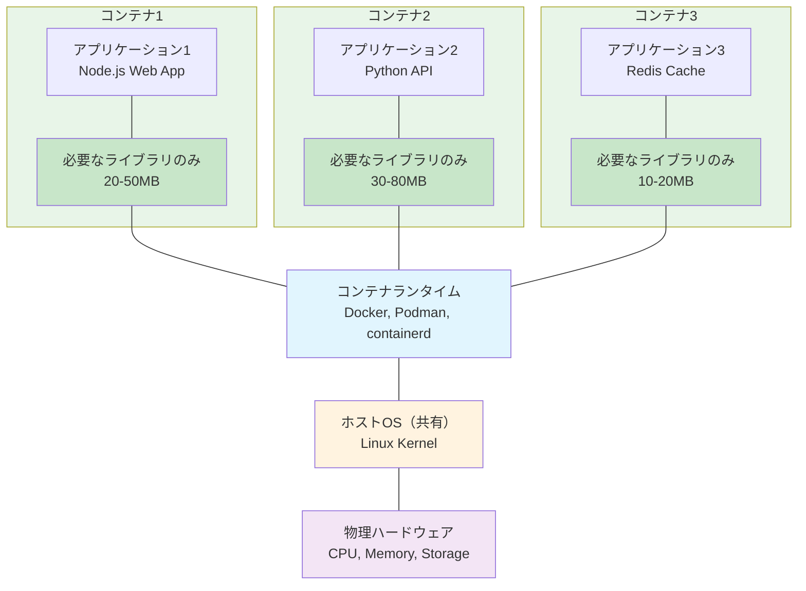

# 第9章：仮想化からコンテナへ - 隔離技術の進化

## 9.1 はじめに：なぜ隔離が必要なのか

あなたがアパートの大家だとしましょう。10部屋あるアパートに10組の家族が住んでいます。各家族にはプライバシーが必要で、他の家族の生活に干渉されたくありません。

コンピュータの世界でも同じです。一つの物理サーバーで複数のアプリケーションを動かすとき、それぞれが独立した環境で動作する必要があります。この「隔離」をどう実現するか。その答えの進化が、仮想化からコンテナへの道のりです。

## 9.2 物理サーバーの非効率性から仮想化、そしてコンテナへ

### 物理サーバー時代の課題

#### 1990年代～2000年代初頭の状況
```
物理サーバーA：メールサーバー（CPU使用率 5%）
物理サーバーB：Webサーバー（CPU使用率 10%）
物理サーバーC：データベース（CPU使用率 20%）

問題：
- ハードウェアの使用率が低い（平均15%）
- 各サーバーの購入・維持コストが高い
- 新しいアプリケーションには新しいサーバーが必要
- 障害時の復旧に時間がかかる
```

### 仮想化技術の登場

#### VMware、Xen、KVMによる革命
```
物理サーバー（1台）
├─ 仮想マシン1：メールサーバー
├─ 仮想マシン2：Webサーバー
└─ 仮想マシン3：データベース

メリット：
- ハードウェアの有効活用（使用率60-80%）
- 迅速なプロビジョニング
- スナップショット、ライブマイグレーション
```

#### 仮想マシンの仕組み
```bash
# KVMを使用した仮想マシンの作成例
$ sudo virt-install \
    --name vm1 \
    --ram 2048 \
    --disk path=/var/lib/libvirt/images/vm1.qcow2,size=20 \
    --vcpus 2 \
    --os-type linux \
    --network bridge=br0 \
    --graphics none \
    --console pty,target_type=serial \
    --location 'http://archive.ubuntu.com/ubuntu/dists/focal/main/installer-amd64/'
```

### 仮想マシンの限界



**問題点**：
- 各VMに完全なOSが必要（メモリ・ディスク消費）
- 起動時間が長い（数十秒～数分）
- オーバーヘッドが大きい

### コンテナの革新



**利点**：
- 軽量（数十MB）
- 高速起動（数秒）
- 効率的なリソース使用

## 9.3 名前空間とcgroupsによる軽量隔離

### Linuxカーネルの隔離機能

#### 名前空間（Namespaces）- 見える範囲の隔離

Linuxの名前空間は、プロセスが見ることができるシステムリソースを制限します：

```bash
# 利用可能な名前空間の種類
Mount   (mnt)   - ファイルシステムのマウントポイント
Process (pid)   - プロセスID
Network (net)   - ネットワークインターフェース、ルーティング
IPC     (ipc)   - プロセス間通信
UTS     (uts)   - ホスト名、ドメイン名
User    (user)  - ユーザーID、グループID
Cgroup  (cgroup)- コントロールグループ
Time    (time)  - システム時刻（Linux 5.6以降）
```

#### 名前空間の実験
```bash
# 新しいネットワーク名前空間を作成
$ sudo unshare --net bash

# 新しい名前空間内では、ネットワークインターフェースが見えない
$ ip link show
1: lo: <LOOPBACK> mtu 65536 qdisc noop state DOWN

# 元の名前空間では通常通り
$ exit
$ ip link show
1: lo: <LOOPBACK,UP,LOWER_UP> mtu 65536
2: eth0: <BROADCAST,MULTICAST,UP,LOWER_UP> mtu 1500
```

#### PID名前空間の隔離
```bash
# pid_namespace_demo.sh
cat > pid_namespace_demo.sh << 'EOF'
#!/bin/bash

echo "=== PID Namespace Demo ==="
echo "Parent PID: $$"
echo "Parent sees these processes:"
ps aux | head -5

echo
echo "Creating new PID namespace..."
sudo unshare --pid --fork --mount-proc bash -c '
    echo "Child PID in new namespace: $$"
    echo "Child sees these processes:"
    ps aux
'
EOF
```

### cgroups（Control Groups）- リソースの制限

#### cgroupsの階層構造
```bash
# cgroup v2の確認
$ mount | grep cgroup2
cgroup2 on /sys/fs/cgroup type cgroup2

# 利用可能なコントローラー
$ cat /sys/fs/cgroup/cgroup.controllers
cpu io memory pids

# CPU使用率を50%に制限
$ sudo mkdir /sys/fs/cgroup/mylimit
$ echo "+cpu" | sudo tee /sys/fs/cgroup/mylimit/cgroup.subtree_control
$ echo "50000 100000" | sudo tee /sys/fs/cgroup/mylimit/cpu.max
# 100000マイクロ秒中50000マイクロ秒使用可能 = 50%

# プロセスをcgroupに追加
$ echo $$ | sudo tee /sys/fs/cgroup/mylimit/cgroup.procs
```

#### メモリ制限の実装
```bash
# memory_limit_demo.sh
cat > memory_limit_demo.sh << 'EOF'
#!/bin/bash

# メモリ制限付きのcgroup作成
sudo mkdir -p /sys/fs/cgroup/memlimit
echo "+memory" | sudo tee /sys/fs/cgroup/cgroup.subtree_control
echo "100M" | sudo tee /sys/fs/cgroup/memlimit/memory.max

# メモリを大量に使用するプログラム
cat > memory_hog.c << 'C'
#include <stdio.h>
#include <stdlib.h>
#include <string.h>
#include <unistd.h>

int main() {
    size_t size = 200 * 1024 * 1024; // 200MB
    char *buffer = malloc(size);
    if (buffer) {
        printf("Allocated 200MB\n");
        memset(buffer, 0, size);
        printf("Memory filled\n");
        sleep(10);
    }
    return 0;
}
C

gcc memory_hog.c -o memory_hog

# cgroup内で実行
echo $$ | sudo tee /sys/fs/cgroup/memlimit/cgroup.procs
./memory_hog  # OOM Killerにより終了される
EOF
```

### 実際のコンテナ作成（手動）

```bash
# manual_container.sh - 手動でコンテナ環境を作成
cat > manual_container.sh << 'EOF'
#!/bin/bash

# 1. ルートファイルシステムの準備
ROOTFS="/tmp/container_root"
mkdir -p $ROOTFS

# 最小限のLinux環境をコピー（Alpine Linuxを使用）
wget -O alpine.tar.gz http://dl-cdn.alpinelinux.org/alpine/v3.18/releases/x86_64/alpine-minirootfs-3.18.0-x86_64.tar.gz
tar -xzf alpine.tar.gz -C $ROOTFS

# 2. 名前空間を分離してchrootで起動
sudo unshare --mount --uts --ipc --net --pid --fork \
    --mount-proc=$ROOTFS/proc \
    chroot $ROOTFS /bin/sh -c '
    # コンテナ内での作業
    hostname container
    echo "Welcome to manual container!"
    echo "Hostname: $(hostname)"
    echo "Process list:"
    ps aux
    echo "Network interfaces:"
    ip addr show
'

# クリーンアップ
sudo rm -rf $ROOTFS alpine.tar.gz
EOF
```

## 9.4 開発と本番環境の一致、迅速なデプロイ

### 「動作環境の違い」問題

#### 従来の問題
```
開発者：「私の環境では動いています」
運用者：「本番環境では動きません」

原因：
- OSのバージョン違い
- ライブラリのバージョン違い
- 設定ファイルの違い
- 環境変数の違い
```

### コンテナによる解決

#### Dockerfileによる環境の定義
```dockerfile
# Dockerfile
FROM python:3.9-slim

# 依存関係のインストール
COPY requirements.txt .
RUN pip install -r requirements.txt

# アプリケーションのコピー
COPY app.py .

# 環境変数の設定
ENV FLASK_APP=app.py
ENV FLASK_ENV=production

# ポートの公開
EXPOSE 5000

# 起動コマンド
CMD ["flask", "run", "--host=0.0.0.0"]
```

#### イメージのビルドと配布
```bash
# 開発環境でビルド
docker build -t myapp:v1.0 .

# レジストリにプッシュ
docker push registry.example.com/myapp:v1.0

# 本番環境でプル&実行
docker pull registry.example.com/myapp:v1.0
docker run -d -p 80:5000 registry.example.com/myapp:v1.0
```

### 迅速なデプロイメントの実現

#### 従来のデプロイメント
```
1. サーバーのプロビジョニング（30分）
2. OSのインストール・設定（1時間）
3. 依存関係のインストール（30分）
4. アプリケーションのデプロイ（15分）
5. 設定・テスト（30分）
合計：2時間45分
```

#### コンテナベースのデプロイメント
```
1. コンテナイメージのプル（1分）
2. コンテナの起動（5秒）
合計：1分5秒
```

### 実践的なCI/CDパイプライン

```yaml
# .gitlab-ci.yml の例
stages:
  - build
  - test
  - deploy

build:
  stage: build
  script:
    - docker build -t $CI_REGISTRY_IMAGE:$CI_COMMIT_SHA .
    - docker push $CI_REGISTRY_IMAGE:$CI_COMMIT_SHA

test:
  stage: test
  script:
    - docker run $CI_REGISTRY_IMAGE:$CI_COMMIT_SHA pytest

deploy:
  stage: deploy
  script:
    - docker tag $CI_REGISTRY_IMAGE:$CI_COMMIT_SHA $CI_REGISTRY_IMAGE:latest
    - docker push $CI_REGISTRY_IMAGE:latest
    - kubectl set image deployment/myapp myapp=$CI_REGISTRY_IMAGE:latest
```

## 9.5 演習：手動でコンテナの仕組みを再現

### 演習1：名前空間の分離を体験

```bash
# namespace_isolation.sh
cat > namespace_isolation.sh << 'EOF'
#!/bin/bash

echo "=== Namespace Isolation Demo ==="

# 1. UTS名前空間（ホスト名の分離）
echo "1. UTS Namespace:"
echo "   Current hostname: $(hostname)"
sudo unshare --uts bash -c '
    hostname isolated-container
    echo "   Isolated hostname: $(hostname)"
'
echo "   Original hostname still: $(hostname)"

# 2. PID名前空間（プロセスの分離）
echo
echo "2. PID Namespace:"
echo "   Current process count: $(ps aux | wc -l)"
sudo unshare --pid --fork --mount-proc bash -c '
    echo "   Isolated process count: $(ps aux | wc -l)"
    ps aux
'

# 3. ネットワーク名前空間
echo
echo "3. Network Namespace:"
echo "   Current interfaces:"
ip -brief addr show
sudo unshare --net bash -c '
    echo "   Isolated interfaces:"
    ip -brief addr show
    echo "   Setting up lo interface..."
    ip link set lo up
    ip -brief addr show
'
EOF

chmod +x namespace_isolation.sh
```

### 演習2：cgroupsによるリソース制限

```bash
# resource_limits.sh
cat > resource_limits.sh << 'EOF'
#!/bin/bash

echo "=== Resource Limitation Demo ==="

# CPU制限のデモ
echo "1. CPU Limitation:"

# CPU負荷生成プログラム
cat > cpu_stress.c << 'C'
#include <stdio.h>
int main() {
    printf("Starting CPU stress...\n");
    while(1) {
        // 無限ループでCPU使用
    }
    return 0;
}
C

gcc cpu_stress.c -o cpu_stress

# cgroup設定
sudo mkdir -p /sys/fs/cgroup/cpu_demo
echo "+cpu" | sudo tee /sys/fs/cgroup/cgroup.subtree_control > /dev/null

# 20% CPU制限
echo "20000 100000" | sudo tee /sys/fs/cgroup/cpu_demo/cpu.max > /dev/null

# バックグラウンドで実行
./cpu_stress &
PID=$!

# 制限なしで5秒間測定
echo "Without limit:"
sleep 5
ps -p $PID -o %cpu | tail -1

# cgroupに追加
echo $PID | sudo tee /sys/fs/cgroup/cpu_demo/cgroup.procs > /dev/null

# 制限ありで5秒間測定
echo "With 20% limit:"
sleep 5
ps -p $PID -o %cpu | tail -1

kill $PID
sudo rmdir /sys/fs/cgroup/cpu_demo
EOF
```

### 演習3：最小限のコンテナランタイム実装

```bash
# mini_container.sh - 最小限のコンテナランタイム
cat > mini_container.sh << 'EOF'
#!/bin/bash

CONTAINER_ID="mini_$(date +%s)"
ROOTFS="/tmp/containers/$CONTAINER_ID"

# コンテナイメージの作成関数
create_rootfs() {
    mkdir -p $ROOTFS/{bin,lib,lib64,etc,proc,sys,dev,tmp}
    
    # 必要なバイナリをコピー
    for bin in sh ls cat echo ps mount umount; do
        cp /bin/$bin $ROOTFS/bin/ 2>/dev/null || \
        cp /usr/bin/$bin $ROOTFS/bin/ 2>/dev/null
    done
    
    # 共有ライブラリをコピー
    for bin in $ROOTFS/bin/*; do
        ldd $bin 2>/dev/null | grep -oE '/[^ ]+' | while read lib; do
            mkdir -p $ROOTFS$(dirname $lib)
            cp $lib $ROOTFS$lib 2>/dev/null
        done
    done
    
    # 基本的な設定ファイル
    echo "container" > $ROOTFS/etc/hostname
    echo "127.0.0.1 localhost" > $ROOTFS/etc/hosts
}

# コンテナ実行関数
run_container() {
    echo "Starting container $CONTAINER_ID..."
    
    sudo unshare --mount --uts --ipc --net --pid --fork \
        bash -c "
        # procとsysをマウント
        mount -t proc proc $ROOTFS/proc
        mount -t sysfs sys $ROOTFS/sys
        
        # ルートファイルシステムを変更
        chroot $ROOTFS /bin/sh -c '
            hostname \$(cat /etc/hostname)
            echo \"Welcome to mini container!\"
            echo \"Container ID: $CONTAINER_ID\"
            echo \"Hostname: \$(hostname)\"
            echo \"Processes:\"
            ps aux 2>/dev/null || ps
            /bin/sh
        '
        
        # クリーンアップ
        umount $ROOTFS/proc
        umount $ROOTFS/sys
    "
}

# メイン処理
create_rootfs
run_container

# 後片付け
sudo rm -rf $ROOTFS
EOF
```

### 演習4：コンテナネットワークの構築

```bash
# container_network.sh
cat > container_network.sh << 'EOF'
#!/bin/bash

echo "=== Container Network Setup ==="

# ネットワーク名前空間の作成
sudo ip netns add container1
sudo ip netns add container2

# 仮想イーサネットペアの作成
sudo ip link add veth1 type veth peer name br-veth1
sudo ip link add veth2 type veth peer name br-veth2

# ブリッジの作成と設定
sudo ip link add br0 type bridge
sudo ip link set br-veth1 master br0
sudo ip link set br-veth2 master br0

# コンテナに仮想インターフェースを移動
sudo ip link set veth1 netns container1
sudo ip link set veth2 netns container2

# IPアドレスの設定
sudo ip netns exec container1 ip addr add 172.20.0.2/24 dev veth1
sudo ip netns exec container2 ip addr add 172.20.0.3/24 dev veth2
sudo ip addr add 172.20.0.1/24 dev br0

# インターフェースを有効化
sudo ip link set br0 up
sudo ip link set br-veth1 up
sudo ip link set br-veth2 up
sudo ip netns exec container1 ip link set veth1 up
sudo ip netns exec container2 ip link set veth2 up

# 接続テスト
echo
echo "Testing connectivity:"
echo "Container1 -> Container2:"
sudo ip netns exec container1 ping -c 3 172.20.0.3

echo
echo "Container2 -> Host:"
sudo ip netns exec container2 ping -c 3 172.20.0.1

# クリーンアップ関数
cleanup() {
    sudo ip link del br0
    sudo ip netns del container1
    sudo ip netns del container2
}

echo
echo "Network setup complete. Type 'cleanup' to remove."
EOF
```

### 演習5：コンテナイメージのレイヤー構造理解

```bash
# layer_demo.sh
cat > layer_demo.sh << 'EOF'
#!/bin/bash

echo "=== Container Image Layers Demo ==="

WORK_DIR="/tmp/layer_demo"
mkdir -p $WORK_DIR
cd $WORK_DIR

# レイヤー1：ベースシステム
echo "Creating Layer 1: Base System"
mkdir -p layer1/{bin,lib,etc}
echo "Base Linux System" > layer1/etc/os-release
echo "Layer 1 size: $(du -sh layer1 | cut -f1)"

# レイヤー2：ランタイム追加
echo
echo "Creating Layer 2: Runtime"
cp -r layer1 layer2
mkdir -p layer2/usr/bin
echo "#!/bin/sh\necho 'Python 3.9 runtime'" > layer2/usr/bin/python3
chmod +x layer2/usr/bin/python3
echo "Layer 2 size: $(du -sh layer2 | cut -f1)"
echo "Layer 2 diff: $(diff -r layer1 layer2 | wc -l) changes"

# レイヤー3：アプリケーション
echo
echo "Creating Layer 3: Application"
cp -r layer2 layer3
mkdir -p layer3/app
echo "print('Hello from container!')" > layer3/app/main.py
echo "Layer 3 size: $(du -sh layer3 | cut -f1)"
echo "Layer 3 diff: $(diff -r layer2 layer3 | wc -l) changes"

# OverlayFSのデモ（簡易版）
echo
echo "Demonstrating OverlayFS:"
mkdir -p overlay/{lower,upper,work,merged}
cp -r layer1/* overlay/lower/
cp -r layer2/* overlay/upper/

# 実際のOverlayFSマウント（要root）
sudo mount -t overlay overlay \
    -o lowerdir=overlay/lower,upperdir=overlay/upper,workdir=overlay/work \
    overlay/merged

echo "Merged filesystem contents:"
ls -la overlay/merged/

sudo umount overlay/merged
rm -rf $WORK_DIR
EOF
```

## 9.6 コンテナ技術の実際

### 本番環境での考慮事項

#### セキュリティ
```bash
# セキュリティスキャン
docker scan myimage:latest

# 非rootユーザーでの実行
FROM node:14
RUN useradd -m appuser
USER appuser
COPY --chown=appuser:appuser . /app
```

#### ログ管理
```bash
# コンテナログの確認
docker logs container_name

# ログドライバーの設定
docker run --log-driver=syslog \
    --log-opt syslog-address=tcp://192.168.1.100:514 \
    myapp:latest
```

#### 監視
```bash
# リソース使用状況
docker stats

# ヘルスチェック
HEALTHCHECK --interval=30s --timeout=3s \
    CMD curl -f http://localhost/health || exit 1
```

## 9.7 まとめ：隔離技術がもたらす革新

### コンテナ技術の本質

本章で学んだコンテナ技術は、以下の革新をもたらしました：

1. **軽量な隔離**：カーネルを共有しながら独立した環境を実現
2. **移植性**：開発から本番まで同じ環境を保証
3. **効率性**：リソースの最適な利用
4. **俊敏性**：秒単位でのデプロイメント

### 技術の進化の流れ

```
物理サーバー（1990年代）
    ↓ リソースの無駄
仮想マシン（2000年代）
    ↓ オーバーヘッドが大きい
コンテナ（2010年代）
    ↓ オーケストレーションが必要
Kubernetes（現在）
```

### 次章への展望

コンテナの基本的な仕組みを理解したところで、次章では実際のコンテナランタイムである「Podman」について学びます。

なぜDockerではなくPodmanなのか。それは、よりセキュアで、より柔軟な、次世代のコンテナ技術だからです。デーモンレス、ルートレスといった革新的な機能を持つPodmanの世界を探求していきましょう。

## 章末演習問題

### 問題1：基本理解の確認
以下の文章の空欄を埋めてください。

1. コンテナ技術で使用されるLinuxカーネルの機能は、（　　　　　）と（　　　　　）です。
2. 仮想マシンは（　　　　）を仮想化し、コンテナは（　　　　）を仮想化します。
3. PID名前空間を使用すると、コンテナ内のプロセスはPID（　）から始まります。

### 問題2：概念の理解
次の質問に答えてください。

1. 仮想マシンとコンテナの違いを、リソース使用効率、起動速度、セキュリティの観点から比較してください。
2. Linuxの名前空間（namespace）の種類を5つ挙げ、それぞれの役割を説明してください。
3. cgroupsがコンテナ技術において果たす役割を具体例を交えて説明してください。

### 問題3：実践的な課題
以下のシナリオに対する解決策を示してください。

1. コンテナ内でメモリを100MBまでに制限する方法
2. 2つのコンテナ間でのみ通信可能なネットワークを構築する方法
3. ホストのディレクトリをコンテナ内にマウントする際のセキュリティ考慮事項

### 問題4：コンテナ作成
以下の要件を満たすDockerfileを作成してください。

- ベースイメージ：Ubuntu 22.04
- Nginx Webサーバーをインストール
- カスタムindex.htmlを/usr/share/nginx/html/に配置
- 非rootユーザー（www-data）で実行
- ヘルスチェックを実装

### 問題5：名前空間の実験
以下の動作を確認するスクリプトを作成してください。

```bash
#!/bin/bash
# namespace_experiment.sh

# 要件：
# 1. 新しいUTS名前空間を作成し、ホスト名を変更
# 2. 新しいPID名前空間を作成し、プロセス一覧を表示
# 3. 新しいネットワーク名前空間を作成し、インターフェースを確認
# 4. 各名前空間での変更がホストに影響しないことを確認

# ここにコードを記述
```

### 問題6：パフォーマンス比較
仮想マシンとコンテナのパフォーマンスを比較する実験を設計してください。

比較項目：
- 起動時間
- メモリ使用量
- CPU使用効率
- ディスクI/O性能

### 問題7：トラブルシューティング
コンテナが起動しない場合の段階的なトラブルシューティング手順を作成してください。

確認項目：
- イメージの存在
- リソースの制限
- ネットワーク設定
- 権限設定

### 問題8：発展的課題
1. コンテナのセキュリティを強化するための技術（seccomp、AppArmor、SELinux）について、それぞれの役割と実装方法を説明してください。

2. マイクロサービスアーキテクチャにおいて、コンテナ技術が果たす役割と課題について論じてください。