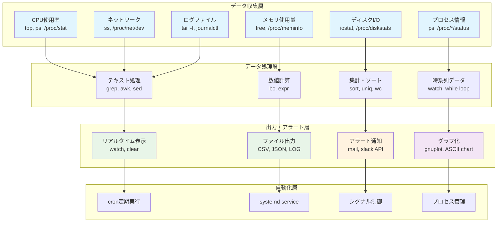

# 第4章：シェルとコマンド - 対話的管理の基礎

## 4.1 はじめに：なぜ黒い画面と向き合うのか

「なぜ2024年にもなって、マウスではなくキーボードで操作するの？」

これは、Linux初心者が必ず抱く疑問です。スマートフォンやタブレットが当たり前の時代に、文字だけの黒い画面（ターミナル）で作業することは、時代遅れに見えるかもしれません。

しかし、プロのエンジニアがCUI（Character User Interface）を選ぶのには、明確な理由があります。それは「効率」「正確性」「自動化」の3つです。

## 4.2 なぜGUIではなくCUIが主流なのか

### 実例で理解する：1000個のファイル名を変更する

あなたは、デジタルカメラで撮影した1000枚の写真ファイルの名前を変更する必要があるとします。

#### GUIでの作業
1. ファイルを一つクリック
2. 右クリックして「名前の変更」
3. 新しい名前を入力
4. Enterキーを押す
5. 次のファイルへ...（これを1000回繰り返す）

所要時間：1ファイル10秒として、約3時間

#### CUIでの作業
```bash
# IMG_*.jpg を photo_001.jpg, photo_002.jpg... に変更
counter=1
for file in IMG_*.jpg; do
    mv "$file" "photo_$(printf %03d $counter).jpg"
    ((counter++))
done
```

所要時間：コマンド入力30秒 + 実行1秒 = 31秒

### CUIの本質的な優位性

#### 1. 再現性 - 同じ作業を確実に繰り返せる

```bash
# 作業手順をスクリプトとして保存
cat > rename_photos.sh << 'EOF'
#!/bin/bash
counter=1
for file in IMG_*.jpg; do
    mv "$file" "photo_$(printf %03d $counter).jpg"
    ((counter++))
done
EOF

# 1年後、同じ作業が必要になったら
bash rename_photos.sh
```

GUIでは「あのとき、どうやったっけ？」となりますが、CUIなら完全に再現できます。

#### 2. 自動化 - 人間の介入なしで実行

```bash
# 毎日午前3時に自動的にバックアップ
crontab -e
# 以下を追加
0 3 * * * /home/user/backup_script.sh
```

サーバー管理において、24時間365日人間が画面を見ているわけにはいきません。

#### 3. リモート操作 - どこからでも同じように作業

```bash
# 東京のオフィスから、大阪のサーバーを操作
ssh osaka-server

# ニューヨークの自宅から、東京のサーバーを操作
ssh tokyo-server
```

GUIをリモートで操作するには大量のデータ転送が必要ですが、CUIならテキストデータだけで済みます。

### 実際の現場での使用例

#### Webサーバーの管理
```bash
# アクセスログから攻撃を検出
grep "SELECT.*FROM.*WHERE" /var/log/nginx/access.log | \
    awk '{print $1}' | sort | uniq -c | sort -rn | head -20

# 攻撃元IPをブロック
for ip in $(上記コマンドの結果); do
    iptables -A INPUT -s $ip -j DROP
done
```

このような緊急対応を、GUIで行うことを想像してみてください。

## 4.3 シェルとは何か - コマンドの通訳者

### シェルの役割

シェルは、人間とカーネルの間に立つ「通訳者」です：

```
人間：「このディレクトリのファイル一覧を見せて」
    ↓
シェル：「なるほど、lsコマンドですね」
    ↓ システムコールに翻訳
カーネル：「了解、ファイル情報を返します」
    ↓
シェル：「見やすい形式に整形しました」
    ↓
人間：「ありがとう！」
```

### 主要なシェルの種類

```bash
# 利用可能なシェルを確認
cat /etc/shells
# /bin/bash    - Bourne Again Shell（最も一般的）
# /bin/sh      - Bourne Shell（基本的なシェル）
# /bin/zsh     - Z Shell（高機能）
# /bin/fish    - Friendly Interactive Shell（初心者向け）
```

本書では、最も普及している`bash`を中心に解説します。

### シェルの基本機能

#### 1. コマンドの実行
```bash
# 単純なコマンド実行
ls

# オプション付き
ls -la

# 引数付き
ls -la /etc
```

#### 2. 変数の管理
```bash
# 変数の設定
NAME="Linux"
echo "Hello, $NAME!"

# 環境変数
export PATH=$PATH:/usr/local/bin
echo $PATH
```

#### 3. 制御構造
```bash
# 条件分岐
if [ -f /etc/passwd ]; then
    echo "パスワードファイルが存在します"
fi

# ループ
for i in {1..5}; do
    echo "Count: $i"
done
```

## 4.4 パイプラインが実現する「部品の組み合わせ」

### パイプの概念

パイプ（|）は、あるコマンドの出力を別のコマンドの入力につなぐ「配管」です：

```
コマンド1の出力 | コマンド2の入力 | コマンド3の入力
```

### 実例：アクセスログの解析

```bash
# 基本：ログファイルを見る
cat access.log

# ステップ1：今日の分だけ抽出
cat access.log | grep "2024-03-15"

# ステップ2：エラー（4xx, 5xx）だけ抽出
cat access.log | grep "2024-03-15" | grep -E "(4[0-9]{2}|5[0-9]{2})"

# ステップ3：IPアドレスだけ取り出す
cat access.log | grep "2024-03-15" | grep -E "(4[0-9]{2}|5[0-9]{2})" | cut -d' ' -f1

# ステップ4：集計してソート
cat access.log | grep "2024-03-15" | grep -E "(4[0-9]{2}|5[0-9]{2})" | \
    cut -d' ' -f1 | sort | uniq -c | sort -rn

# 結果：エラーを多く発生させているIPアドレスのランキング
```

### パイプラインの設計思想

#### 1. 各コマンドは単機能
- `grep`：パターンマッチング
- `cut`：フィールド抽出
- `sort`：並び替え
- `uniq`：重複除去
- `wc`：カウント

#### 2. 入出力の標準化
すべてのコマンドは：
- 標準入力から読む
- 標準出力に書く
- エラーは標準エラー出力へ

この統一により、どんなコマンドも自由に組み合わせられます。

### 強力なテキスト処理コマンド

#### grep - パターン検索
```bash
# 基本的な検索
grep "error" logfile.txt

# 大文字小文字を無視
grep -i "error" logfile.txt

# 正規表現を使用
grep -E "^[0-9]{1,3}\.[0-9]{1,3}\.[0-9]{1,3}\.[0-9]{1,3}" logfile.txt

# マッチしない行を表示
grep -v "success" logfile.txt

# マッチした行数をカウント
grep -c "error" logfile.txt
```

#### sed - ストリームエディタ
```bash
# 文字列の置換
echo "Hello World" | sed 's/World/Linux/'

# ファイル内の全置換
sed -i 's/old/new/g' file.txt

# 特定の行を削除
sed '5d' file.txt  # 5行目を削除

# パターンにマッチする行を削除
sed '/^#/d' config.file  # コメント行を削除
```

#### awk - パターン処理言語
```bash
# 特定のフィールドを抽出
ps aux | awk '{print $1, $11}'  # ユーザー名とコマンド名

# 条件付き処理
df -h | awk '$5 > 80 {print $6 " is " $5 " full"}'  # 使用率80%以上

# 集計
ls -l | awk '{sum += $5} END {print "Total:", sum}'  # ファイルサイズの合計

# 複雑な処理
awk '{
    count[$1]++
} END {
    for (ip in count) {
        print ip, count[ip]
    }
}' access.log  # IPアドレスごとのアクセス数
```

## 4.5 自動化・再現性・監査証跡の確保

### なぜ自動化が重要なのか

#### 人的ミスの排除
```bash
# 手作業の場合
1. サーバーAにログイン
2. 設定ファイルを編集
3. サービスを再起動
4. サーバーBにログイン
5. 設定ファイルを編集（あれ、さっきと同じ内容だっけ？）
6. サービスを再起動（あれ、コマンド何だっけ？）

# 自動化スクリプト
for server in serverA serverB serverC; do
    scp nginx.conf $server:/etc/nginx/
    ssh $server "nginx -t && systemctl reload nginx"
done
```

### スクリプト化の基本

#### シェルスクリプトの構造
```bash
#!/bin/bash
# daily_backup.sh - 日次バックアップスクリプト

# 設定
BACKUP_DIR="/backup"
SOURCE_DIR="/var/www"
DATE=$(date +%Y%m%d)
LOG_FILE="/var/log/backup.log"

# 関数定義
log_message() {
    echo "[$(date '+%Y-%m-%d %H:%M:%S')] $1" | tee -a $LOG_FILE
}

# メイン処理
log_message "バックアップ開始"

# バックアップディレクトリ作成
if [ ! -d "$BACKUP_DIR/$DATE" ]; then
    mkdir -p "$BACKUP_DIR/$DATE"
fi

# バックアップ実行
if tar -czf "$BACKUP_DIR/$DATE/www_backup.tar.gz" "$SOURCE_DIR" 2>>$LOG_FILE; then
    log_message "バックアップ成功"
    
    # 古いバックアップを削除（7日以上前）
    find $BACKUP_DIR -type d -mtime +7 -exec rm -rf {} \; 2>/dev/null
    log_message "古いバックアップを削除"
else
    log_message "エラー: バックアップ失敗"
    exit 1
fi

log_message "バックアップ完了"
```

### 監査証跡（Audit Trail）の重要性

#### historyコマンドによる操作履歴
```bash
# 実行したコマンドの履歴を見る
history

# 特定のコマンドを検索
history | grep nginx

# タイムスタンプ付きで記録
export HISTTIMEFORMAT="%Y-%m-%d %H:%M:%S "
history
```

#### scriptコマンドによる完全な記録
```bash
# セッション全体を記録
script -a /var/log/admin/session_$(date +%Y%m%d_%H%M%S).log

# 作業実施...

# 記録終了
exit

# 後で確認
cat /var/log/admin/session_*.log
```

### 実践的な自動化の例

#### 1. システム監視スクリプト
```bash
#!/bin/bash
# monitor.sh - シンプルなシステム監視

# しきい値設定
CPU_THRESHOLD=80
MEM_THRESHOLD=90
DISK_THRESHOLD=85

# CPU使用率チェック
cpu_usage=$(top -bn1 | grep "Cpu(s)" | awk '{print $2}' | cut -d'%' -f1)
if (( $(echo "$cpu_usage > $CPU_THRESHOLD" | bc -l) )); then
    echo "警告: CPU使用率が${cpu_usage}%です" | mail -s "CPU Alert" admin@example.com
fi

# メモリ使用率チェック
mem_usage=$(free | grep Mem | awk '{print ($2-$7)/$2 * 100}')
if (( $(echo "$mem_usage > $MEM_THRESHOLD" | bc -l) )); then
    echo "警告: メモリ使用率が${mem_usage}%です" | mail -s "Memory Alert" admin@example.com
fi

# ディスク使用率チェック
df -h | grep -vE '^Filesystem|tmpfs|devtmpfs' | awk '{print $5 " " $6}' | while read usage mount; do
    usage_int=${usage%\%}
    if [ $usage_int -ge $DISK_THRESHOLD ]; then
        echo "警告: $mount のディスク使用率が${usage}です" | mail -s "Disk Alert" admin@example.com
    fi
done
```

#### 2. ログローテーションスクリプト
```bash
#!/bin/bash
# log_rotate.sh - カスタムログローテーション

LOG_DIR="/var/log/myapp"
ARCHIVE_DIR="/var/log/myapp/archive"
DAYS_TO_KEEP=30

# アーカイブディレクトリ作成
mkdir -p $ARCHIVE_DIR

# ログファイルをローテート
for logfile in $LOG_DIR/*.log; do
    if [ -f "$logfile" ]; then
        basename=$(basename "$logfile")
        timestamp=$(date +%Y%m%d_%H%M%S)
        
        # 圧縮してアーカイブ
        gzip -c "$logfile" > "$ARCHIVE_DIR/${basename%.log}_$timestamp.gz"
        
        # 元のログファイルをクリア
        > "$logfile"
    fi
done

# 古いアーカイブを削除
find $ARCHIVE_DIR -name "*.gz" -mtime +$DAYS_TO_KEEP -delete

echo "ログローテーション完了: $(date)"
```

## 4.6 演習：同じ作業をGUIとCUIで比較

### 演習1：ファイル検索の比較

#### タスク：ホームディレクトリ以下で、過去7日間に変更された.txtファイルを探す

**GUI方式**：
1. ファイルマネージャーを開く
2. 検索機能を起動
3. 検索条件を設定（拡張子、日付）
4. 検索実行
5. 結果を確認

**CUI方式**：
```bash
find ~ -name "*.txt" -mtime -7
```

**発展**：見つかったファイルの合計サイズを計算
```bash
find ~ -name "*.txt" -mtime -7 -exec ls -l {} \; | awk '{sum += $5} END {print "Total: " sum " bytes"}'
```

### 演習2：大量ファイルの一括処理

#### タスク：100個のCSVファイルの1行目（ヘッダー）だけを抽出して一つのファイルにまとめる

**準備**：テスト用のCSVファイルを作成
```bash
# テストデータ作成
for i in {1..100}; do
    echo "id,name,email,date" > test_$i.csv
    echo "$i,User$i,user$i@example.com,2024-03-15" >> test_$i.csv
done
```

**GUI方式**：
1. 各ファイルを開く
2. 1行目をコピー
3. 新しいファイルにペースト
4. 100回繰り返す...

**CUI方式**：
```bash
# 方法1：headコマンドを使用
for file in test_*.csv; do
    head -1 "$file"
done > headers.txt

# 方法2：awkを使用
awk 'FNR==1' test_*.csv > headers.txt
```

### 演習3：システム情報の定期収集

#### タスク：5秒ごとにCPU使用率を記録し、1分後にグラフ化する

```bash
# データ収集スクリプト
cat > collect_cpu.sh << 'EOF'
#!/bin/bash
echo "timestamp,cpu_usage" > cpu_data.csv
for i in {1..12}; do
    timestamp=$(date +%s)
    cpu=$(top -bn1 | grep "Cpu(s)" | awk '{print $2}' | cut -d'%' -f1)
    echo "$timestamp,$cpu" >> cpu_data.csv
    sleep 5
done
EOF

# 実行
bash collect_cpu.sh

# 簡易グラフ表示（gnuplotが必要）
gnuplot -e "
set datafile separator ',';
set xlabel 'Time';
set ylabel 'CPU Usage (%)';
plot 'cpu_data.csv' using 1:2 with lines title 'CPU Usage';
pause -1
"
```

### 演習4：エラーログの自動監視

#### タスク：ログファイルを監視し、特定のエラーが出たら通知する

```bash
# 監視スクリプト
cat > watch_errors.sh << 'EOF'
#!/bin/bash
LOG_FILE="/var/log/syslog"
ERROR_PATTERN="error|failed|critical"
NOTIFICATION_METHOD="echo"  # 実際はmail,slackなど

# 最後に読んだ位置を記録
BOOKMARK_FILE="/tmp/log_bookmark"
if [ ! -f "$BOOKMARK_FILE" ]; then
    echo 0 > "$BOOKMARK_FILE"
fi

# 前回の位置から読む
last_position=$(cat "$BOOKMARK_FILE")
current_size=$(stat -c%s "$LOG_FILE")

if [ $current_size -gt $last_position ]; then
    # 新しい部分だけを読む
    tail -c +$((last_position + 1)) "$LOG_FILE" | grep -iE "$ERROR_PATTERN" | while read line; do
        $NOTIFICATION_METHOD "Error detected: $line"
    done
    
    # 現在位置を保存
    echo $current_size > "$BOOKMARK_FILE"
fi
EOF

# cronで定期実行
crontab -e
# */5 * * * * /path/to/watch_errors.sh
```

### 演習5：統合演習 - Webサーバーのアクセス解析ダッシュボード

```bash
#!/bin/bash
# web_analytics.sh - リアルタイムWebアクセス解析

analyze_log() {
    local log_file="/var/log/nginx/access.log"
    
    echo "=== Web Access Analytics - $(date) ==="
    echo
    
    # 総アクセス数
    total_requests=$(wc -l < "$log_file")
    echo "Total Requests: $total_requests"
    echo
    
    # ステータスコード別集計
    echo "Status Code Distribution:"
    awk '{print $9}' "$log_file" | sort | uniq -c | sort -rn | head -10
    echo
    
    # トップ10アクセスページ
    echo "Top 10 Pages:"
    awk '{print $7}' "$log_file" | sort | uniq -c | sort -rn | head -10
    echo
    
    # トップ10アクセス元IP
    echo "Top 10 Client IPs:"
    awk '{print $1}' "$log_file" | sort | uniq -c | sort -rn | head -10
    echo
    
    # 時間帯別アクセス数
    echo "Hourly Access Pattern:"
    awk '{print substr($4,14,2)}' "$log_file" | sort | uniq -c
    echo
    
    # レスポンスサイズの統計
    echo "Response Size Statistics:"
    awk '{sum+=$10; count++} END {
        print "Total bytes: " sum
        print "Average bytes: " sum/count
    }' "$log_file"
}

# リアルタイム更新
while true; do
    clear
    analyze_log
    echo
    echo "Refreshing in 10 seconds... (Press Ctrl+C to stop)"
    sleep 10
done
```

## 4.6 システムパフォーマンス監視ダッシュボード

### リアルタイム監視システムの構築



### 統合監視スクリプト実装例

```bash
#!/bin/bash
# comprehensive_monitor.sh - 包括的システム監視

# 設定
ALERT_CPU=80
ALERT_MEM=90
ALERT_DISK=85
LOG_FILE="/var/log/system_monitor.log"

# メトリクス収集関数
collect_metrics() {
    local timestamp=$(date "+%Y-%m-%d %H:%M:%S")
    
    # CPU使用率（vmstatでより信頼性の高い取得）
    local cpu_usage=$(vmstat 1 2 | tail -1 | awk '{print 100-$15}')
    
    # メモリ使用率
    local mem_total=$(grep MemTotal /proc/meminfo | awk '{print $2}')
    local mem_avail=$(grep MemAvailable /proc/meminfo | awk '{print $2}')
    local mem_usage=$(echo "scale=1; (($mem_total - $mem_avail) * 100) / $mem_total" | bc)
    
    # ディスク使用率
    local disk_usage=$(df -h / | tail -1 | awk '{print $5}' | sed 's/%//')
    
    # ネットワーク統計（プライマリインターフェースを動的検出）
    local primary_interface=$(awk -F':' '/:/ {if ($1 !~ /lo/ && $2 !~ /^ *0/) {gsub(/^ */, "", $1); print $1; exit}}' /proc/net/dev)
    local net_rx=$(cat /proc/net/dev | grep "$primary_interface" | awk '{print $2}')
    local net_tx=$(cat /proc/net/dev | grep "$primary_interface" | awk '{print $10}')
    
    # プロセス数
    local proc_count=$(ps aux | wc -l)
    
    # JSON形式で出力
    echo "{
        \"timestamp\": \"$timestamp\",
        \"cpu_usage\": $cpu_usage,
        \"mem_usage\": $mem_usage,
        \"disk_usage\": $disk_usage,
        \"network\": {\"rx_bytes\": $net_rx, \"tx_bytes\": $net_tx},
        \"process_count\": $proc_count
    }" | tee -a "$LOG_FILE"
    
    # アラート判定
    check_alerts "$cpu_usage" "$mem_usage" "$disk_usage"
}

# アラート判定関数
check_alerts() {
    local cpu=$1
    local mem=$2
    local disk=$3
    
    if (( $(echo "$cpu > $ALERT_CPU" | bc -l) )); then
        send_alert "CPU" "$cpu%"
    fi
    
    if (( $(echo "$mem > $ALERT_MEM" | bc -l) )); then
        send_alert "Memory" "$mem%"
    fi
    
    if [ "$disk" -gt "$ALERT_DISK" ]; then
        send_alert "Disk" "$disk%"
    fi
}

# アラート送信関数
send_alert() {
    local metric=$1
    local value=$2
    local message="ALERT: $metric usage is $value ($(date))"
    
    echo "$message" | tee -a "$LOG_FILE"
    # 実際の通知（メール、Slack等）はここに実装
}

# メイン監視ループ
main() {
    echo "Starting system monitoring..."
    echo "Press Ctrl+C to stop"
    
    trap 'echo "Monitoring stopped"; exit 0' SIGINT SIGTERM
    
    while true; do
        clear
        echo "=== System Performance Dashboard ==="
        echo "Time: $(date)"
        echo
        
        collect_metrics
        
        sleep 5
    done
}

main "$@"
```

## 4.7 まとめ：CUIマスターへの道

### CUIスキルの段階的習得

#### レベル1：基本コマンドを覚える
```bash
ls, cd, cp, mv, rm, cat, grep, less
```

#### レベル2：パイプとリダイレクトを使いこなす
```bash
command1 | command2 > output.txt 2>&1
```

#### レベル3：シェルスクリプトを書く
```bash
#!/bin/bash
# 条件分岐、ループ、関数を含むスクリプト
```

#### レベル4：高度なテキスト処理
```bash
sed, awk, perl one-liners
```

#### レベル5：システム全体の自動化
```bash
# CI/CD、監視、デプロイメントの自動化
```

### CUIがもたらす本質的な価値

1. **思考の速度で操作できる**：タイピングさえ速ければ、思考と同じ速度で操作可能
2. **完全な再現性**：同じコマンドは常に同じ結果を生む
3. **無限の組み合わせ**：小さなコマンドから複雑な処理を構築
4. **どこでも同じ**：ローカルでもリモートでも同じ操作

### 次章への橋渡し

CUIを使いこなすということは、複数のプログラムを協調させて動かすということです。次章では、これらのプログラム（プロセス）がどのように生成され、実行され、終了するのかを学びます。

プロセスの理解は、システムの動作を理解する上で不可欠です。なぜなら、Linuxシステムで起きるすべてのことは、プロセスの振る舞いとして説明できるからです。

## 章末演習問題

### 問題1：基本理解の確認
以下の文章の空欄を埋めてください。

1. シェルは人間と（　　　）の間に立つ（　　　）の役割を果たします。
2. パイプ（|）は、あるコマンドの（　　　）を別のコマンドの（　　　）につなぎます。
3. リダイレクトで、標準出力は（　）、標準エラー出力は（　）、両方を同じファイルに出力するには（　　　　）と記述します。

### 問題2：コマンドの理解
次のコマンドが何をするか説明してください。

1. `find /var/log -name "*.log" -mtime +30 -exec rm {} \;`
2. `ps aux | grep nginx | grep -v grep | awk '{print $2}' | xargs kill -HUP`
3. `tail -f /var/log/syslog | grep -E "error|warning" | tee alerts.log`

### 問題3：実践的な課題
以下のタスクを実現するコマンドまたはシェルスクリプトを作成してください。

1. カレントディレクトリ以下のすべての.txtファイルの中から、"TODO"という文字列を含む行を、ファイル名と行番号付きで表示する。

2. 直近1時間のシステムログ(/var/log/syslog)から、各ログレベル（ERROR、WARNING、INFO）の出現回数を集計して表示する。

3. 指定したディレクトリ内の各サブディレクトリのディスク使用量を計算し、使用量の多い順に上位10個を表示する。

### 問題4：パイプラインの設計
次の要件を満たすコマンドパイプラインを設計してください。

Webサーバーのアクセスログ（/var/log/nginx/access.log）から：
- 本日のアクセスのみを抽出
- ステータスコード404のものだけを選択
- アクセス元IPアドレスごとに集計
- 多い順に並べ替え
- 上位20件を表示

### 問題5：シェルスクリプトの作成
以下の機能を持つシェルスクリプトを作成してください。

```bash
#!/bin/bash
# log_monitor.sh - ログファイル監視スクリプト

# 要件：
# 1. 引数でログファイルのパスを受け取る
# 2. そのファイルをリアルタイムで監視
# 3. "ERROR"という文字列が現れたら、その行を error_$(date +%Y%m%d).log に追記
# 4. 1分間にERRORが10回以上出現したら、アラートメッセージを表示
# 5. Ctrl+Cで終了時に、総ERROR数を表示

# ここにコードを記述
```

### 問題6：トラブルシューティング
以下のシェルスクリプトにはバグがあります。問題を特定し、修正してください。

```bash
#!/bin/bash
# ディスク使用率が80%を超えたらアラートを出すスクリプト

threshold=80
df -h | grep -v "Filesystem" | while read line
do
    usage=$(echo $line | awk '{print $5}' | sed 's/%//')
    mount=$(echo $line | awk '{print $6}')
    
    if [ $usage > $threshold ]; then
        echo "Warning: $mount is $usage% full"
    fi
done
```

### 問題7：発展的課題
1. GUIとCUIのそれぞれの利点と欠点を整理し、どのような場面でどちらを選択すべきか、あなたの考えを述べてください。

2. 現代のDevOpsやSREの文脈において、シェルスクリプトがどのように活用されているか、具体例を挙げて説明してください。